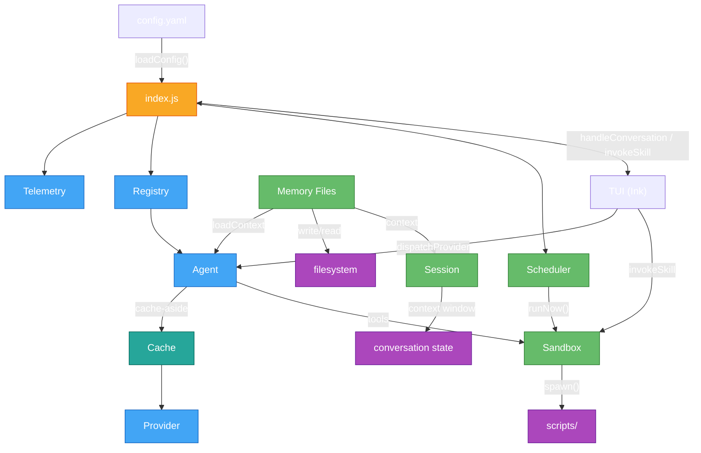
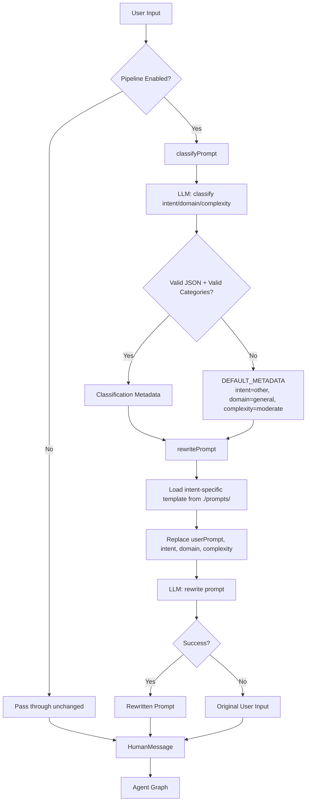
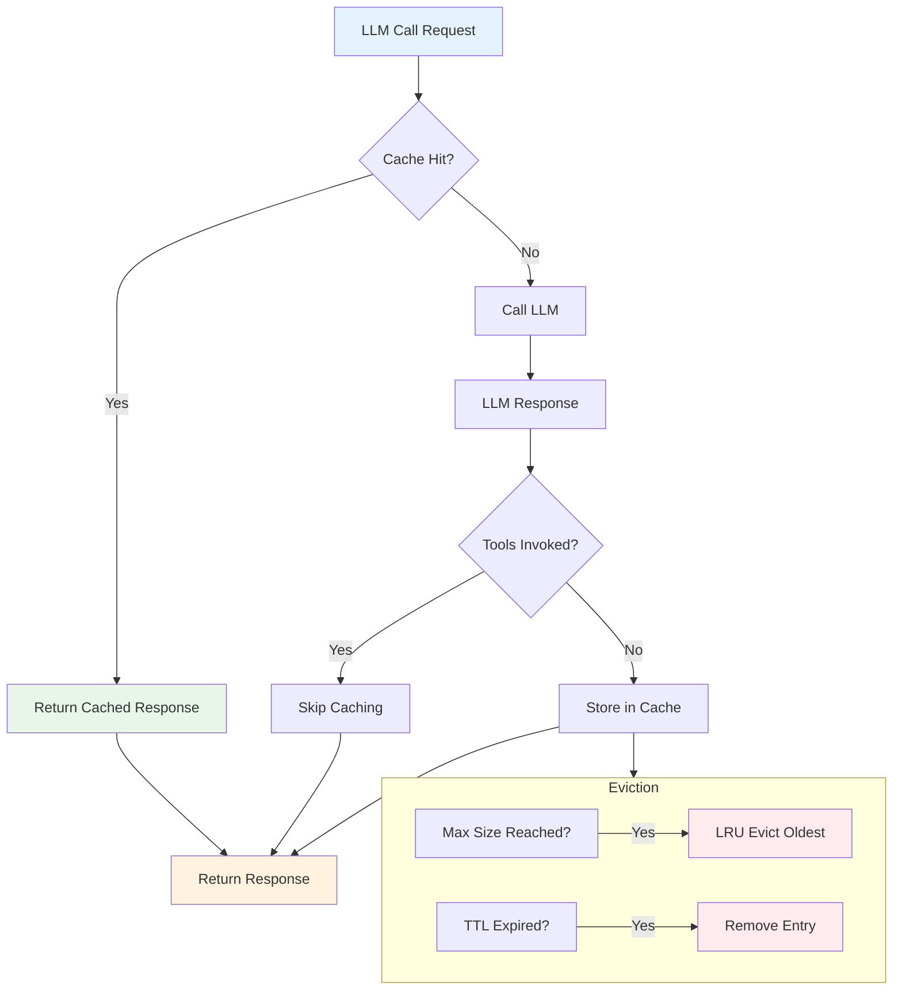
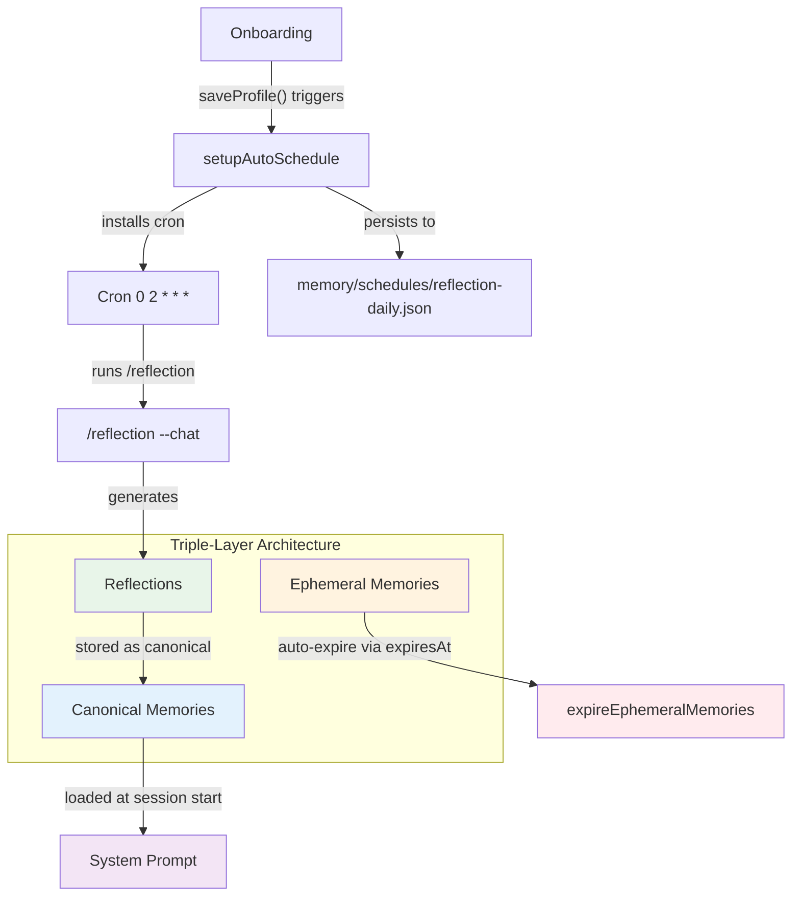
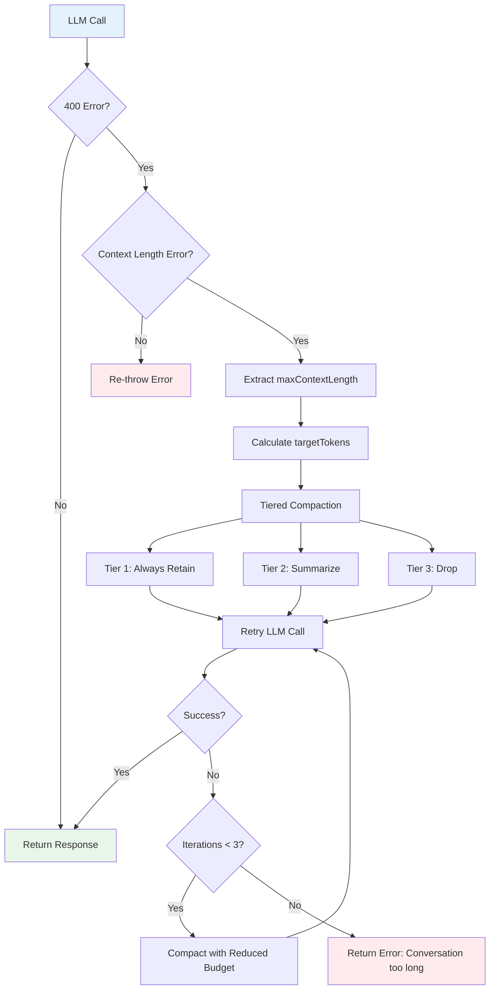

# Architecture Overview

This document describes how madz is structured, how subsystems interact, and the key data flows through them. It covers the runtime components — not how to configure or contribute code (see [README.md](../README.md) and [CODE_STYLE.md](./CODE_STYLE.md)).

---

## System Diagram



---

## Entry Point

`index.js` bootstraps all subsystems and wires them together.

**Startup:**

1. `loadConfig()` → reads `config.yaml`, deep-merges defaults, resolves env vars, validates via Zod
2. Conditionally boots Telemetry (`config.telemetry.enabled`)
3. Creates `SkillRegistry`, calls `discover("skills/")`
4. Loads memory system, creates session + `SessionStateManager`
5. Creates `ScheduleManager`, defines `dispatchProvider()`, `handleConversation()`, `invokeSkill()`

**Shutdown:** saves session → cleans retained memory → flushes OpenTelemetry.

**TUI exports:** `config`, `sessionId`, `sessionState`, `registry`, `dispatchProvider`, `handleConversation`, `invokeSkill`, `handleShutdown`, `scheduleManager`, `setConfigValue`, `loadContext`, memory helpers.

---

## Config

`src/config/` — YAML config with Zod validation, recursive env var resolution, runtime mutation.

| File | Purpose |
|------|---------|
| `schemas.js` | Zod schemas: `ConfigSchema`, `ProvidersSchema`, `SandboxScopeSchema`, etc. |
| `loader.js` | Loads `config.yaml`, merges defaults, resolves env vars, validates |
| `mutate.js` | `parseValue()`, `assignPath()`, `applyDotPathMutation()` — dot-path mutation with Zod validation |

Env var resolution maps config paths → `UPPER_SNAKE_CASE` (e.g., `sandbox.timeout.seconds` → `SANDBOX_TIMEOUT_SECONDS`). `'providers'`/`'credentials'`/`'process'` containers are dropped from the name path. String env values auto-parsed to booleans/numbers. Legacy `${VAR_NAME}` interpolation supported as fallback.

---

## Logger

`src/logger.js` — structured JSON logging via `pino` with OS-aware log directories and dual-file output.

| File | Purpose |
|------|---------|
| `logger.js` | `getLogDirectory()` — OS path detection; `logger` — structured methods (`info`, `warn`, `error`, `debug`, `fatal`, `silent`); `flush()` — async shutdown flush |

**Log directory by platform:**

| Platform     | Path                          | Detection                          |
| ------------ | ----------------------------- | ---------------------------------- |
| Alpine       | `~/.cache/madz/logs/`         | `/etc/alpine-release` exists       |
| Linux        | `~/.local/share/madz/logs/`   | Default (XDG spec)                 |
| macOS        | `~/Library/Logs/madz/`        | `process.platform === "darwin"`    |
| Windows      | `%LOCALAPPDATA%\madz\logs\`   | `process.platform === "win32"`     |

The directory is created automatically (`mkdirSync({ recursive: true })`). If the configured directory is unwritable, the logger falls back to `os.tmpdir()/madz/logs/`. If that fallback also fails, log entries are silently discarded—the process never crashes due to permission errors.

**Dual-file output** via `pino.multistream`:
- `madz.log` — captures `info`, `warn`, `debug`, `trace`, and all higher severity levels
- `madz_error.log` — captures only `error` and `fatal`

**Silent mode**: `NODE_ENV=test` sets pino to `level: 'silent'`, preventing any file I/O during test runs.

**Shutdown flush**: Both the graceful shutdown handler (`handleShutdown`) and the global shutdown signal wrapper (`registerShutdownHandler`) call `await logger.flush()` before process exit, ensuring all buffered log entries are written to disk. The flush includes a `setTimeout(50)` safeguard to account for the kernel write-back delay on Node.js 25+.

---

## Provider

`src/provider/` — LLM provider factory from configuration.

| File | Purpose |
|------|---------|
| `openai.js` | `createChatModel()` — produces `ChatOpenAI` from `ProviderConfig` |

The provider config includes an optional `encoding` field (mapped from `OPENAI_ENCODING` env var) that specifies the tiktoken encoder name for token counting. This is primarily useful when using non-OpenAI models via `OPENAI_BASE_URL`.

The provider instance is consumed by `Agent` (via `createReactAgent`) or `dispatchProvider()` in `index.js`.

---

## Agent

`src/agent/` — ReAct agent wrapper around LangGraph's prebuilt builder.

| File | Purpose |
|------|---------|
| `react.js` | `createReactAgent()` — compiles `createReactAgentGraph`; `callReactAgent()` — runs loop, returns response |
| `promptPipeline/index.js` | `classifyPrompt()` — LLM-based intent/domain/complexity classification; `rewritePrompt()` — intent-aware prompt optimization; `processPrompt()` — orchestrator |
| `promptPipeline/categories.js` | Category enums (`INTENT_CATEGORIES`, `DOMAIN_CATEGORIES`, `COMPLEXITY_CATEGORIES`), validation functions, `DEFAULT_METADATA` |
| `promptPipeline/prompts.js` | Classification prompt template; loads intent-specific rewrite templates from `./prompts/REWRITE_{INTENT}.md` |

The agent runs: reason → call tool(s) → reason again → answer. Tool array built by `buildToolConfig()` gates definitions on sandbox permissions.

---

## Prompt Rewrite Pipeline

`src/agent/promptPipeline/` — A two-stage LLM pre-processing pipeline that classifies and rewrites user prompts before they reach the agent graph. Disabled by default (`config.agent.promptRewrite.enabled: false`).



**Pipeline stages:**

| Stage | Function | Input | Output |
|-------|----------|-------|--------|
| **Classify** | `classifyPrompt(model, userPrompt)` | Raw prompt string | `{ intent, domain, complexity }` metadata |
| **Rewrite** | `rewritePrompt(model, userPrompt, metadata)` | Raw prompt + metadata | Optimized prompt string |
| **Orchestrate** | `processPrompt(model, userPrompt)` | Raw prompt string | `{ rewrittenPrompt, metadata }` |

**External templates:** Intent-specific rewrite templates are loaded from `./prompts/REWRITE_{INTENT}.md`:

| Intent | Template File |
|--------|---------------|
| `question` | `./prompts/REWRITE_QUESTION.md` |
| `task` | `./prompts/REWRITE_TASK.md` |
| `creative` | `./prompts/REWRITE_CREATIVE.md` |
| `analysis` | `./prompts/REWRITE_ANALYSIS.md` |
| `other` (default) | `./prompts/REWRITE_OTHER.md` |

Templates use `{{placeholder}}` syntax for `userPrompt`, `intent`, `domain`, and `complexity`. Unknown intents fall back to `REWRITE_OTHER.md`. If external files are missing, an inline default template is used.

**Error handling:** The pipeline is fail-safe — classification failures return default metadata, rewriting failures return the original message, and any unhandled errors fall back to the original message. The agent graph always receives a `HumanMessage` with the same structure.

**Configuration:**

| Config Path | Default | Description |
|-------------|---------|-------------|
| `agent.promptRewrite.enabled` | `false` | Enable the prompt classification and rewriting pipeline |

| Env Var | Default | Description |
|---------|---------|-------------|
| `AGENT_PROMPT_REWRITE_ENABLED` | `false` | Enable the prompt classification and rewriting pipeline |

---

## Sub-Agent

`src/tools/subAgent.js` — spawns child processes (`node index.js --sub-agent --cwd=... --message="..."`) to execute prompts as independent sub-agents. Supports single execution and fan-out (parallel/sequential) modes with configurable concurrency, timeout, and error handling.

| File | Purpose |
|------|---------|
| `subAgent.js` | `createSubAgentTool()` — LangChain tool with marker-based stdout parsing; `parseSubAgentOutput()` — extracts structured results from sub-agent output; `escapeShellArg()` — handles quotes, backticks, dollar signs, newlines, tabs, carriage returns; `resolveTimeout()` — per-call > env var > config default priority; `spawnSubAgentProcess()` — spawns `node index.js --sub-agent --cwd=... --message="..."`, captures OS-level PID |

**Key features:**

1. **Single execution mode** — Spawn one sub-agent with delegation + context, return structured result
2. **Fan-out mode** — Parallel/sequential task execution with configurable `maxConcurrent` limit
3. **Marker-based stdout parsing** — `# SubAgent` marker for result extraction (mirrors compaction tool)
4. **Response contract** — `{ ok, result, error?, pid? }` matching compaction tool pattern
5. **Process tracking** — Shared `processTracker` from terminal.js for PID tracking and lifecycle management
6. **Timeout resolution** — Per-call > env var > config default priority
7. **Parameter extraction** — Optional `returnParams` for JSON result filtering with fallback
8. **Working directory** — `cwd` parameter passed to sub-agent process; all file operations resolved from this directory
9. **Shell escaping** — Handles quotes, backticks, dollar signs, newlines, tabs, carriage returns
10. **Error handling** — `continue` vs `fail-fast` strategies for fan-out batches
11. **OS-level PID tracking** — Captures the actual child process PID from `spawn()` for correlation with tracked processes

**Configuration:** Sub-agent parameters are set via `config.process.subAgent`:

| Key | Default | Description |
| --- | --- | --- |
| `process.subAgent.timeout` | `600000` | Sub-agent process timeout in milliseconds (default 10 minutes) |
| `process.subAgent.maxConcurrent` | `4` | Max concurrent sub-agent processes |
| `process.subAgent.sessionMode` | `isolated` | Session isolation mode (`isolated`, `forked`, `shared`) |
| `process.subAgent.defaultStrategy` | `parallel` | Default fan-out strategy (`parallel`, `sequential`) |
| `process.subAgent.defaultOnError` | `continue` | Default error handling strategy (`continue`, `fail-fast`) |

---


## Scan Agents

`src/tools/scanAgents.js` — scans for `AGENTS.md` files in a target directory. Delegates to `loadAgents()` from `src/workspace/loadAgents.js` with path validation.

| File | Purpose |
|------|---------|
| `scanAgents.js` | `createScanAgentsTool()` — LangChain tool with `filesystem:read` permission; `scanAgentsImpl()` — validates path, delegates to `loadAgents()`; `ScanAgentsSchema` — zod schema with optional `path` parameter |

**Key features:**

1. **Path validation** — Validates target path against sandbox allowed paths
2. **Configurable path** — Defaults to `config.cwd` if no path specified
3. **File size limit** — Respects `maxReadSize` configuration
4. **Workspace rules** — Returns formatted workspace rules section for system prompt injection


## Sub-Agent Log

`src/tools/subAgentLog.js` — manages and reads subAgent log files stored in `/tmp`. Supports listing all active logs with PID and running status, reading a specific log by PID, and cleaning up old logs beyond a configurable age threshold.

| File | Purpose |
|------|---------|
| `subAgentLog.js` | `createSubAgentLogTool()` — LangChain tool with zero permissions (always registered); `listLogs()` — scans `/tmp` for `sub-agent-{pid}.log` files, returns sorted array with PID, file, size, modified time, and running status; `readLog(pid)` — reads a specific log file by PID; `cleanupLogs(maxAgeHours)` — removes logs older than the configured age threshold (default: 24 hours); `isProcessRunning(pid)` — checks if a PID is still active via `process.kill(pid, 0)` |

**Key features:**

1. **Log discovery** — Scans `/tmp` for files matching `sub-agent-{pid}.log` pattern
2. **Process status** — Reports whether each sub-agent process is still running
3. **Age-based cleanup** — Removes logs older than a configurable threshold (default: 24 hours)
4. **Zero permissions** — Always registered, no sandbox permissions required

**Configuration:** Log directory is hardcoded to `/tmp`. Age threshold is configurable via the `maxAgeHours` parameter (default: 24).

---


## Sub-Agent Message

`src/tools/subAgentMessage.js` — sends messages to running subAgent processes via stdin. Requires the target process to be tracked (spawned via subAgent tool) and have stdin exposed.

| File | Purpose |
|------|---------|
| `subAgentMessage.js` | `createSubAgentMessageTool()` — LangChain tool with `process:spawn` permission; `subAgentMessageImpl(input)` — looks up PID in `processTracker`, validates process is running, writes message to stdin |

**Key features:**

1. **Process lookup** — Validates PID exists in `processTracker`
2. **Status check** — Ensures process is still running before writing
3. **Stdin write** — Appends newline to message before writing to stdin
4. **Error handling** — Clear error messages for missing PID, missing message, process not found, or process not running

**Prerequisites:** The target subAgent process must be spawned with `stdio: ["pipe", "pipe", "pipe"]` (stdin exposed). The subAgent tool was updated to expose stdin for this to work.

---


## Cache

`src/cache/` — cache-aside LRU response cache for LLM API calls.

| File | Purpose |
|------|---------|
| `llm_cache.js` | `createLlmCache(size, ttl)` — creates a tiny-lru-backed cache with `get()`, `set()`, `clear()` methods; `getCacheKey(threadId, message)` — generates `${threadId}_${sha256_hash}` cache keys |

**How it works:**



1. **Cache-aside pattern:** Before every LLM call (both streaming and non-streaming), the system checks the cache using a key derived from the thread ID and SHA-256 hash of the message content. On a hit, the cached response is returned immediately without an API call. On a miss, the LLM is called and the response is stored.
2. **Conditional caching:** Responses are only cached when no tools or skills were invoked during agent execution. This prevents state-changing operations from being skipped on subsequent identical prompts.
3. **Streaming support:** For streaming calls, the cache is checked before the stream begins. On successful completion, the aggregated final response is stored — individual chunks are never cached. Failed or aborted streams do not cache partial responses.
4. **Eviction:** The cache enforces a maximum size (default: 100 entries) with LRU eviction. Entries expire after the configured TTL (default: 600000ms / 10 minutes).
5. **Fail-open:** Cache retrieval or storage failures never block or prevent an LLM call.

**Configuration:** Cache parameters are set via `config.lru.size` (default: 100) and `config.lru.ttl` (default: 600000). The cache is lazily initialized on first use — if config is unavailable, it falls back to defaults.

---

## Memory

`src/memory/` — persistent Markdown storage with YAML frontmatter, triple-layer architecture (canonical + ephemeral + reflection), and automated daily reflection scheduling.

| File | Purpose |
|------|---------|
| `writer.js` | `writeMemoryFile()` — writes timestamped `.md` files with YAML frontmatter, auto-slugifies titles |
| `reader.js` | `parseFrontmatter()` — YAML frontmatter parsing via `js-yaml`; `readMemoryFile()` — loads and parses a single memory file |
| `context.js` | `loadContext()` — scans context directory for `.md` files, loads profile, returns combined string sorted by `timestamp` frontmatter |
| `retention.js` | `cleanRetainedMemory()` — removes files older than `retentionDays` (default 90); `enforceMaxEntries()` — caps directory at `maxEntries` (default 1000) by oldest mtime |
| `loadMemories.js` | `loadMemories()` — loads all entries sorted by `updatedDate` descending; `formatMemoriesForPrompt()` — formats entries with category labels (`USER PROFILE`, `USER CLARIFICATIONS`, `WORKING REFLECTION`, `TEMPORAL CAPTURE`); `parseEntryFile()` — parses a single entry's frontmatter + body |
| `profile.js` | User profile CRUD: `loadProfile()`, `saveProfile()`, `hasProfile()`, `formatProfileContext()`, `sanitizeProfileData()`. Defines 12 attributes (name, dob, relationship, pets, hobbies, expertise, favorite bands/books/tv/movies, location, notes) with onboarding state machine (`INIT → ATTRACTOR → COLLECT → SAVE → TRANSCEND`) and control pattern matching (`skip`, `cancel`, `exit`) |
| `expireEphemeral.js` | `expireEphemeralMemories()` — scans context directory, removes `.md` files with `ephemeral: true` + expired `expiresAt`; `isExpired()` — checks `expiresAt` against current time; `readEphemeralFile()` — extracts ephemeral metadata from frontmatter |
| `gc.js` | V8 garbage collection manager: `gc()` — triggers `global.gc()` with rate limiting (default 4 calls/hour, sliding window); `initGC()` — creates idle-timer controller with `onActivity()` reset and `stop()`; `isAvailable()` — checks `--expose-gc`; `getGcCalls()` / `_resetGcCalls()` — call tracking for testing |
| `prompts.js` | `loadSystemPrompt()` — loads `prompts/SYSTEM_PROMPT.md`, strips YAML frontmatter if present |

**Triple-Layer Architecture:**

- **Canonical Memories** — Long-term, user-defined context stored as individual `.md` files in `memory/context/`. Each carries `createdDate` and `updatedDate` in YAML frontmatter. Loaded at session start and appended to the system prompt. Includes profile, clarifications, reflections, and temporal captures.

- **Ephemeral Memories** — Autonomously captured moments (victories, frustrations, insights) with automatic expiration via `expiresAt` frontmatter field. Cleaned by `expireEphemeralMemories()` on a scheduled basis. These create a living lens that subtly influences tone and awareness over time.

- **Reflections** — Generated daily by a cron job (`0 2 * * *`) that runs `/reflection` via `--chat` mode. Reflections are stored as canonical memories in `memory/context/` with `createdDate` and `updatedDate` metadata. The cron job is auto-installed on first onboarding completion, persisted as `memory/schedules/reflection-daily.json`, and registered in the system crontab under the `madz-schedules` block.



`src/scheduler/autoSchedule.js` — `setupAutoSchedule()` returns a callback invoked after `saveProfile()` succeeds during onboarding. It automatically installs a `reflection-daily` cron job (`0 2 * * *`) into the system crontab and persists the job definition as `memory/schedules/reflection-daily.json`. The job invokes `node index.js --chat "/reflection"` at 2 AM daily.

---

## Registry / Skills

`src/registry/` — skill discovery, validation, and permission management.

| File | Purpose |
|------|---------|
| `types.js` | `SkillMetadataSchema`, `PermissionSchema` (6 scopes), `DEFAULT_PERMS` |
| `discoverer.js` | `discoverSkills()` — scans for `SKILL.md`, extracts frontmatter |
| `validator.js` | `validateSkillSchema()` — name (1-64 chars), description, optional fields |
| `registry.js` | `SkillRegistry` — Map-based `discover`, `get`, `list`, `enable`, `disable` |
| `permissions.js` | `resolvePermissions()` — merge defaults with skill-specific perms; `resolveCapabilities()` → `{resources, rules}[]` |

---

## Sandbox

`src/sandbox/` — secure skill execution via spawned processes with resource limits.

| File | Purpose |
|------|---------|
| `runner.js` | `runSandbox()` — `spawn()`, memory limits, capture stdout/stderr, timeout |
| `pathResolver.js` | `resolvePath()` / `assertPathAllowed()` — sandbox scope enforcement |
| `urlFilter.js` | `filterUrl()` — blocks `file://`, `gopher://`, `dict://`; hostname allowlist |
| `envInjector.js` | `injectEnv()` / `filterEnv()` — whitelist env vars |
| `capability.js` | `enforceCapabilities()` — permissions → `{resources, rules}[]` |
| `timeoutHandler.js` | `handleTimeout()` — SIGTERM → SIGKILL after grace period |

---

## Scheduler

`src/scheduler/` — cron job management via system crontab. Scheduling is delegated to the system crontab; there is no in-process clock tick loop.

| File | Purpose |
|------|---------|
| `scheduler.js` | `ScheduleManager` — simple CRUD class (register, list, pause, resume, runNow). No in-process scheduling. |
| `cron.js` | `Cron` object with static methods: `isAvailable()`, `add()`, `remove()`. Manages entries in system crontab using `# --- BEGIN madz-schedules ---` / `# --- END madz-schedules ---` block delimiters. |
| `autoSchedule.js` | `setupAutoSchedule()` — returns callback invoked after `saveProfile()` during onboarding. Installs `reflection-daily` cron job (`0 2 * * *`) into system crontab and persists to `memory/schedules/reflection-daily.json`. |
| `index.js` | Re-exports `ScheduleManager` and `Cron`. |

---

## Session

`src/session/` — per-session state with context window trimming and persistence.

| File | Purpose |
|------|---------|
| `factory.js` | `createSession()` — `{sessionId: UUID, state: {...}}` |
| `stateManager.js` | `SessionStateManager` — `addExchange()`, `setContextWindow()`, `getState()` |
| `window.js` | `enforceContextWindow()` — trims oldest exchanges |
| `loader.js` / `saver.js` | `loadSession()` / `saveSession()` — persists `.md` per session |
| `shutdown.js` | `handleShutdown()` — orchestrates flush/save/cleanup |
| `checkpointer.js` | `createCheckpointer()` — `MemorySaver` or `SQLiteCheckpointer` |
| `onboarding.js` | State machine: `INIT → ATTRACTOR → COLLECT → SAVE → TRANSCEND` |

```javascript
{
  provider: "openai",
  conversation: [{role, content, timestamp}, ...],
  contextWindow: 20,
  skills: ["host-info", "api-request"],
  createdAt: ISODate,
  updatedAt: ISODate
}
```

---

## Context Window Management

`src/tools/compactContext.js` — automatic conversation context compaction triggered when the LLM returns a 400 error indicating the conversation has exceeded the model's maximum context length.

| File | Purpose |
|------|---------|
| `compactContext.js` | `createCompactContextTool()` — LangChain tool with tiered retention strategy; `isContextLengthError()` — detects context-length 400 errors via regex; `extractContextLength()` — extracts max context length from error message; `compactConversation()` — rewrites conversation to fit within a token budget |

**How it works:**



1. **Error detection:** `callReactAgent` and `callReactAgentStreaming` catch LLM 400 errors matching patterns like `"maximum context length is X tokens"` or `"(limit: X)"`
2. **Budget calculation:** `targetTokens = maxContextLength (from error) - maxTokens (from config)`
3. **Tiered compaction:** The `compactContext` tool rewrites the conversation using three tiers:
   - **Tier 1 (Always Retain):** System prompt, most recent user message, last 3 assistant responses with tool calls
   - **Tier 2 (Summarize):** Previous 5-10 exchanges summarized into concise bullet-point previews
   - **Tier 3 (Drop):** Oldest exchanges beyond the summary window are dropped entirely
4. **Automatic retry:** After compaction, the system retries the LLM call. If the error persists, it compacts again with a reduced budget, up to 3 iterations
5. **Fallback:** If even the minimal context (system prompt + last user message) exceeds the budget, a user-facing error is returned: "The conversation is too long. Please start a new session."

The compaction tool is registered with zero permissions (always available) and is accessible both as an automatic recovery mechanism and as a LangChain tool the agent can invoke directly.

---

## Telemetry

`src/telemetry/` — OpenTelemetry tracing and redaction.

| File | Purpose |
|------|---------|
| `provider.js` | `initTelemetry()` — `NodeSDK` with HTTP/gRPC or console exporter |
| `redaction.js` | `createRedactionMiddleware()` — recursive path redaction (e.g., `"credentials.apiKey"`) |
| `llmInstrumenter.js` | `instrumentLlmCall()` — ML span attributes |
| `skillInstrumenter.js` | `instrumentSkillExecution()` — skill span attributes |
| `metrics.js` | Token counter and duration histogram |
| `sampler.js` | Probability-based span sampling |
| `flusher.js` | Pending span queue for shutdown safety |

---

## TUI

`src/tui/` — terminal UI built with Ink (React-based).

| File | Purpose |
|------|---------|
| `app.js` | Main layout: Banner / ConversationPanel, StatusBar, InputPanel |
| `commandParser.js` | `CommandParser` class — dispatches `:` commands |
| `conversationPanel.js` | Virtualized message display via `ink-scroll-view` |
| `inputPanel.js` | Text entry with `Blink` cursor animation |
| `markdownText.js` | Renders markdown via `marked.parse()` + `marked-terminal` |
| `banner.js` / `statusBar.js` / `panels.js` | Startup banner, status indicator, panel definitions |

---

## Key Data Flows

**Conversation flow:**

```
index.js
  handleConversation(message)
    ├── enforceContextWindow()     ← trim oldest exchanges
    ├── loadContext()              ← prepend context markdown
    ├── dispatchProvider()         ← Provider → Agent → ReAct loop
    └── writeMemoryFile()          ← persists to filesystem
```

**Skill invocation:**

```
index.js
  invokeSkill(name, input)
    ├── registry.get(name)
    ├── resolvePermissions(metadata)    ← merge with defaults
    ├── enforceCapabilities()           ← {rules, resources}
    └── runSandbox({script, permissions, ...input})
          ├── resolvePath() / filterUrl() / filterEnv()
          ├── child_process.spawn()
          └── handleTimeout(seconds, grace)     ← SIGTERM → SIGKILL
```

**Scheduler flow:**

```
ScheduleManager.register(config.schedules.entries)
  └── entries stored in #scheduleEntry Map

ScheduleManager.runNow(name, scheduler)
  ├── entry = #scheduleEntry.get(name)
  ├── contextPrefix = loadContext(entry.contextFile) or loadContext("memory/context/")
  └── sandbox({ skillName: entry.skill, input: entry.input, context: contextPrefix })
```

**Cron system flow:**

```
Cron.add({ name, cron, command })
  ├── _readCrontab() → current crontab content
  ├── if entry exists → { added: false, error }
  ├── insert `<cron>  <command>  # madz-schedule: <name>` between BEGIN/END markers
  └── execSync(`crontab -`) → write updated crontab
```
