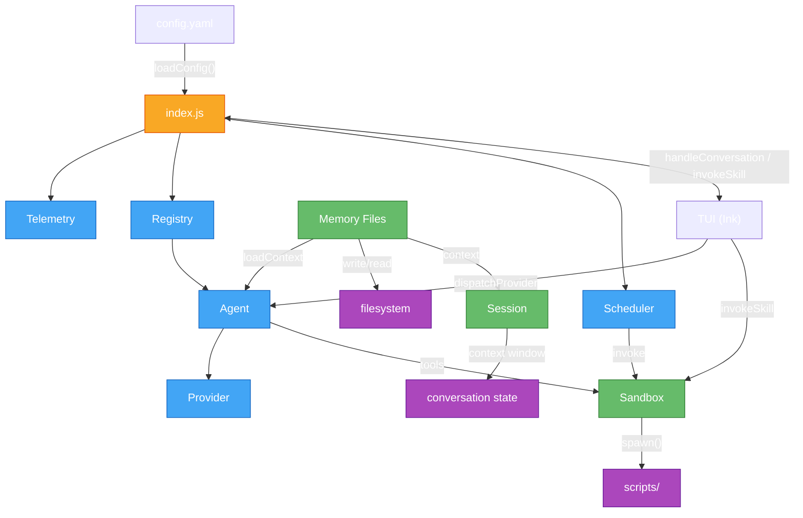

# Architecture Overview

This document describes how madz is structured, how subsystems interact, and the key data flows through them. It covers the runtime components — not how to configure or contribute code (see [README.md](../README.md) and [CODE_STYLE.md](./CODE_STYLE.md)).

---

## System Diagram



---

## Entry Point

`index.js` bootstraps all subsystems and wires them together.

**Startup:**

1. `loadConfig()` → reads `config.yaml`, deep-merges defaults, resolves env vars, validates via Zod
2. Conditionally boots Telemetry (`config.telemetry.enabled`)
3. Creates `SkillRegistry`, calls `discover("skills/")`
4. Loads memory system, creates session + `SessionStateManager`
5. Creates `ScheduleManager`, defines `dispatchProvider()`, `handleConversation()`, `invokeSkill()`

**Shutdown:** saves session → cleans retained memory → flushes OpenTelemetry.

**TUI exports:** `config`, `sessionId`, `sessionState`, `registry`, `dispatchProvider`, `handleConversation`, `invokeSkill`, `handleShutdown`, `scheduleManager`, `setConfigValue`, `loadContext`, memory helpers.

---

## Config

`src/config/` — YAML config with Zod validation, recursive env var resolution, runtime mutation.

| File | Purpose |
|------|---------|
| `schemas.js` | Zod schemas: `ConfigSchema`, `ProvidersSchema`, `SandboxScopeSchema`, etc. |
| `loader.js` | Loads `config.yaml`, merges defaults, resolves env vars, validates |
| `mutate.js` | `parseValue()`, `assignPath()`, `applyDotPathMutation()` — dot-path mutation with Zod validation |

Env var resolution maps config paths → `UPPER_SNAKE_CASE` (e.g., `sandbox.timeout.seconds` → `SANDBOX_TIMEOUT_SECONDS`). `'providers'`/`'credentials'` containers are dropped from the name path. String env values auto-parsed to booleans/numbers. Legacy `${VAR_NAME}` interpolation supported as fallback.

---

## Provider

`src/provider/` — LLM provider factory from configuration.

| File | Purpose |
|------|---------|
| `openai.js` | `createChatModel()` — produces `ChatOpenAI` from `ProviderConfig` |

The provider instance is consumed by `Agent` (via `createReactAgent`) or `dispatchProvider()` in `index.js`.

---

## Agent

`src/agent/` — ReAct agent wrapper around LangGraph's prebuilt builder.

| File | Purpose |
|------|---------|
| `react.js` | `createReactAgent()` — compiles `createReactAgentGraph`; `callReactAgent()` — runs loop, returns response |

The agent runs: reason → call tool(s) → reason again → answer. Tool array built by `buildToolConfig()` gates definitions on sandbox permissions.

---

## Memory

`src/memory/` — persistent Markdown storage with YAML frontmatter, triple-layer architecture (canonical + ephemeral + reflection), and automated daily reflection scheduling.

| File | Purpose |
|------|---------|
| `writer.js` | `writeMemoryFile()` — writes timestamped `.md` files with YAML frontmatter, auto-slugifies titles |
| `reader.js` | `parseFrontmatter()` — YAML frontmatter parsing via `js-yaml`; `readMemoryFile()` — loads and parses a single memory file |
| `context.js` | `loadContext()` — scans context directory for `.md` files, loads profile, returns combined string sorted by `timestamp` frontmatter |
| `retention.js` | `cleanRetainedMemory()` — removes files older than `retentionDays` (default 90); `enforceMaxEntries()` — caps directory at `maxEntries` (default 1000) by oldest mtime |
| `loadMemories.js` | `loadMemories()` — loads all entries sorted by `updatedDate` descending; `formatMemoriesForPrompt()` — formats entries with category labels (`USER PROFILE`, `USER CLARIFICATIONS`, `WORKING REFLECTION`, `TEMPORAL CAPTURE`); `parseEntryFile()` — parses a single entry's frontmatter + body |
| `profile.js` | User profile CRUD: `loadProfile()`, `saveProfile()`, `hasProfile()`, `formatProfileContext()`, `sanitizeProfileData()`. Defines 12 attributes (name, dob, relationship, pets, hobbies, expertise, favorite bands/books/tv/movies, location, notes) with onboarding state machine (`INIT → ATTRACTOR → COLLECT → SAVE → TRANSCEND`) and control pattern matching (`skip`, `cancel`, `exit`) |
| `expireEphemeral.js` | `expireEphemeralMemories()` — scans context directory, removes `.md` files with `ephemeral: true` + expired `expiresAt`; `isExpired()` — checks `expiresAt` against current time; `readEphemeralFile()` — extracts ephemeral metadata from frontmatter |
| `gc.js` | V8 garbage collection manager: `gc()` — triggers `global.gc()` with rate limiting (default 4 calls/hour, sliding window); `initGC()` — creates idle-timer controller with `onActivity()` reset and `stop()`; `isAvailable()` — checks `--expose-gc`; `getGcCalls()` / `_resetGcCalls()` — call tracking for testing |
| `prompts.js` | `loadSystemPrompt()` — loads `prompts/SYSTEM_PROMPT.md`, strips YAML frontmatter if present |

**Triple-Layer Architecture:**

- **Canonical Memories** — Long-term, user-defined context stored as individual `.md` files in `memory/context/`. Each carries `createdDate` and `updatedDate` in YAML frontmatter. Loaded at session start and appended to the system prompt. Includes profile, clarifications, reflections, and temporal captures.

- **Ephemeral Memories** — Autonomously captured moments (victories, frustrations, insights) with automatic expiration via `expiresAt` frontmatter field. Cleaned by `expireEphemeralMemories()` on a scheduled basis. These create a living lens that subtly influences tone and awareness over time.

- **Reflections** — Generated daily by a cron job (`0 2 * * *`) that runs `/reflection` via `--chat` mode. Reflections are stored as canonical memories in `memory/context/` with `createdDate` and `updatedDate` metadata. The cron job is auto-installed on first onboarding completion, persisted as `memory/schedules/reflection-daily.json`, and registered in the system crontab under the `madz-schedules` block.

`src/scheduler/autoSchedule.js` — `setupAutoSchedule()` returns a callback invoked after `saveProfile()` succeeds during onboarding. It automatically installs a `reflection-daily` cron job (`0 2 * * *`) into the system crontab and persists the job definition as `memory/schedules/reflection-daily.json`. The job invokes `node index.js --chat "/reflection"` at 2 AM daily.

---

## Registry / Skills

`src/registry/` — skill discovery, validation, and permission management.

| File | Purpose |
|------|---------|
| `types.js` | `SkillMetadataSchema`, `PermissionSchema` (6 scopes), `DEFAULT_PERMS` |
| `discoverer.js` | `discoverSkills()` — scans for `SKILL.md`, extracts frontmatter |
| `validator.js` | `validateSkillSchema()` — name (1-64 chars), description, optional fields |
| `registry.js` | `SkillRegistry` — Map-based `discover`, `get`, `list`, `enable`, `disable` |
| `permissions.js` | `resolvePermissions()` — merge defaults with skill-specific perms; `resolveCapabilities()` → `{resources, rules}[]` |

---

## Sandbox

`src/sandbox/` — secure skill execution via forked processes with resource limits.

| File | Purpose |
|------|---------|
| `runner.js` | `runSandbox()` — `fork()`, memory limits, capture stdout/stderr, timeout |
| `pathResolver.js` | `resolvePath()` / `assertPathAllowed()` — sandbox scope enforcement |
| `urlFilter.js` | `filterUrl()` — blocks `file://`, `gopher://`, `dict://`; hostname allowlist |
| `envInjector.js` | `injectEnv()` / `filterEnv()` — whitelist env vars |
| `capability.js` | `enforceCapabilities()` — permissions → `{resources, rules}[]` |
| `timeoutHandler.js` | `handleTimeout()` — SIGTERM → SIGKILL after grace period |

---

## Scheduler

`src/scheduler/` — cron scheduling with concurrency control and context inheritance.

| File | Purpose |
|------|---------|
| `parser.js` | `parseScheduleEntry()` — validates via `cron-parser` |
| `matcher.js` | `matchesCron()` — timezone-safe 5/6-field matching |
| `cronInstaller.js` | `CronInstaller` — system crontab management |
| `queue.js` | `ScheduleQueue` — FIFO with `maxConcurrent` enforcement |
| `runner.js` | `runScheduledSkill()` — context loading, sandbox timeout, invocation |
| `scheduler.js` | `ScheduleManager` — registers, manages queue, `#clockTick` loop, `pause`/`resume`/`runNow` |

Two modes: `inprocess` (timed tick, default) and `system` (delegates to system crontab).

---

## Session

`src/session/` — per-session state with context window trimming and persistence.

| File | Purpose |
|------|---------|
| `factory.js` | `createSession()` — `{sessionId: UUID, state: {...}}` |
| `stateManager.js` | `SessionStateManager` — `addExchange()`, `setContextWindow()`, `getState()` |
| `window.js` | `enforceContextWindow()` — trims oldest exchanges |
| `loader.js` / `saver.js` | `loadSession()` / `saveSession()` — persists `.md` per session |
| `shutdown.js` | `handleShutdown()` — orchestrates flush/save/cleanup |
| `checkpointer.js` | `createCheckpointer()` — `MemorySaver` or `SQLiteCheckpointer` |
| `onboarding.js` | State machine: `INIT → ATTRACTOR → COLLECT → SAVE → TRANSCEND` |

```javascript
{
  provider: "openai",
  conversation: [{role, content, timestamp}, ...],
  contextWindow: 20,
  skills: ["host-info", "api-request"],
  createdAt: ISODate,
  updatedAt: ISODate
}
```

---

## Telemetry

`src/telemetry/` — OpenTelemetry tracing and redaction.

| File | Purpose |
|------|---------|
| `provider.js` | `initTelemetry()` — `NodeSDK` with HTTP/gRPC or console exporter |
| `redaction.js` | `createRedactionMiddleware()` — recursive path redaction (e.g., `"credentials.apiKey"`) |
| `llmInstrumenter.js` | `instrumentLlmCall()` — ML span attributes |
| `skillInstrumenter.js` | `instrumentSkillExecution()` — skill span attributes |
| `metrics.js` | Token counter and duration histogram |
| `sampler.js` | Probability-based span sampling |
| `flusher.js` | Pending span queue for shutdown safety |

---

## TUI

`src/tui/` — terminal UI built with Ink (React-based).

| File | Purpose |
|------|---------|
| `app.js` | Main layout: Banner / ConversationPanel, StatusBar, InputPanel |
| `commandParser.js` | `CommandParser` class — dispatches `:` commands |
| `conversationPanel.js` | Virtualized message display via `ink-scroll-view` |
| `inputPanel.js` | Text entry with `Blink` cursor animation |
| `markdownText.js` | Renders markdown via `marked.parse()` + `marked-terminal` |
| `banner.js` / `statusBar.js` / `panels.js` | Startup banner, status indicator, panel definitions |

---

## Key Data Flows

**Conversation flow:**

```
index.js
  handleConversation(message)
    ├── enforceContextWindow()     ← trim oldest exchanges
    ├── loadContext()              ← prepend context markdown
    ├── dispatchProvider()         ← Provider → Agent → ReAct loop
    └── writeMemoryFile()          ← persists to filesystem
```

**Skill invocation:**

```
index.js
  invokeSkill(name, input)
    ├── registry.get(name)
    ├── resolvePermissions(metadata)    ← merge with defaults
    ├── enforceCapabilities()           ← {rules, resources}
    └── runSandbox({script, permissions, ...input})
          ├── resolvePath() / filterUrl() / filterEnv()
          ├── child_process.fork()
          └── handleTimeout(seconds, grace)     ← SIGTERM → SIGKILL
```

**Scheduler flow:**

```
ScheduleManager.register(config.schedules.entries)
  └── setInterval(() => #clockTick())
        ├── matchesCron → queue.enqueue(entry)
        └── dequeue() → runScheduledSkill() → runSandbox() + logScheduleResult()
```
