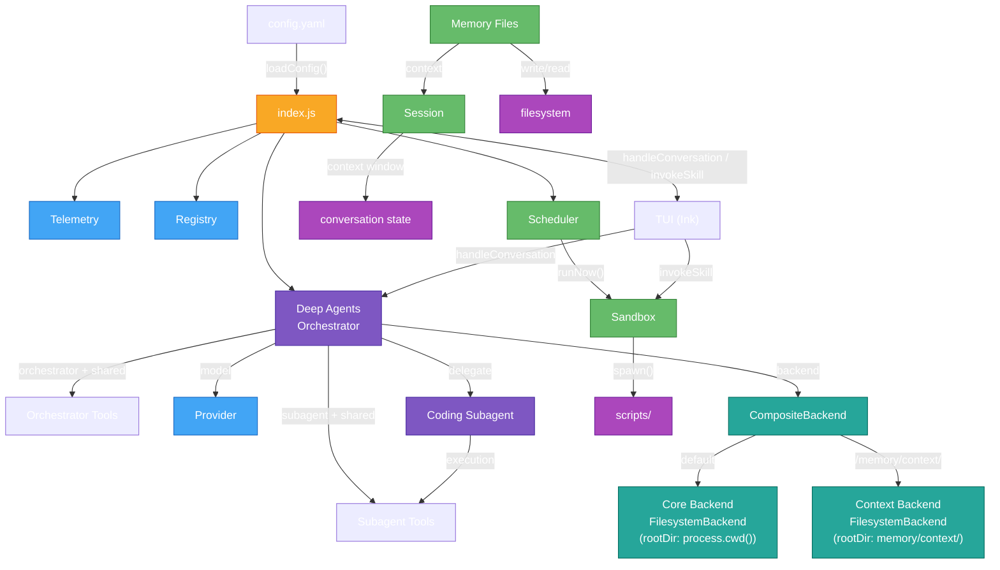

# Architecture Overview

This document describes how madz is structured, how subsystems interact, and the key data flows through them. It covers the runtime components — not how to configure or contribute code.

---

## System Diagram


```mermaid
graph TD
    C["config.yaml"] -->|"loadConfig()"| I["index.js"]
    I --> T["Telemetry"]
    I --> R["Registry"]
    I --> S["Scheduler"]
    I --> DA["Deep Agents\nOrchestrator"]
    DA -->|"orchestrator + shared"| OT["Orchestrator Tools"]
    DA -->|"subagent + shared"| ST["Subagent Tools"]
    DA -->|"model"| P["Provider"]
    DA -->|"backend"| CB["CompositeBackend"]
    CB -->|"default"| CFB["Core Backend\nFilesystemBackend\n(rootDir: process.cwd())"]
    CB -->|"/memory/context/"| CTB["Context Backend\nFilesystemBackend\n(rootDir: memory/context/)"]
    DA -->|"delegate"| SA["Coding Subagent"]
    SA -->|"execution"| ST
    S -->|"runNow()"| SB["Sandbox"]
    SB -->|"spawn()"| SK["scripts/"]
    TM["Memory Files"] -->|"context"| SE["Session"]
    SE -->|context window| CW["conversation state"]
    TM -->|write/read| FS["filesystem"]
    UI["TUI (Ink)"] -->|"handleConversation"| DA
    UI -->|"invokeSkill"| SB
    I <-->|handleConversation / invokeSkill| UI
    classDef root fill:#f9a825,color:#fff,stroke:#e65100
    classDef core fill:#42a5f5,color:#fff,stroke:#1565c0
    classDef util fill:#66bb6a,color:#fff,stroke:#2e7d32
    classDef ext fill:#ab47bc,color:#fff,stroke:#6a1b9a
    classDef cache fill:#26a69a,color:#fff,stroke:#00695c
    classDef agent fill:#7e57c2,color:#fff,stroke:#4527a0
    classDef backend fill:#26a69a,color:#fff,stroke:#00695c
    class I root
    class DA,P,T,R core
    class DA,SA agent
    class S,TM,SE,SB util
    class SK,CW,FS ext
    class CB,CFB,CTB,DB backend
```

---

## Entry Point

`index.js` bootstraps all subsystems and wires them together.

**Startup:**

1. `loadConfig()` → reads `config.yaml`, deep-merges defaults, resolves env vars, validates via Zod
2. Conditionally boots Telemetry (`config.telemetry.enabled`)
3. Creates `SkillRegistry`, calls `discover("skills/")`
4. Loads memory system, creates session + `SessionStateManager`
5. Creates `ScheduleManager`, defines `dispatchProvider()`, `handleConversation()`, `invokeSkill()`

**Shutdown:** saves session → cleans retained memory → flushes OpenTelemetry.

**TUI exports:** `config`, `sessionId`, `sessionState`, `registry`, `dispatchProvider`, `handleConversation`, `invokeSkill`, `handleShutdown`, `scheduleManager`, `setConfigValue`, `loadContext`, memory helpers.

---

## Config

`src/config/` — YAML config with Zod validation, recursive env var resolution, runtime mutation.

| File | Purpose |
|------|---------|
| `schemas.js` | Zod schemas: `ConfigSchema`, `ProvidersSchema`, `SandboxScopeSchema`, etc. |
| `loader.js` | Loads `config.yaml`, merges defaults, resolves env vars, validates |
| `mutate.js` | `parseValue()`, `assignPath()`, `applyDotPathMutation()` — dot-path mutation with Zod validation |

Env var resolution maps config paths → `UPPER_SNAKE_CASE` (e.g., `sandbox.timeout.seconds` → `SANDBOX_TIMEOUT_SECONDS`). `'providers'`/`'credentials'`/`'process'` containers are dropped from the name path. String env values auto-parsed to booleans/numbers. Legacy `${VAR_NAME}` interpolation supported as fallback.

---

## Logger

`src/logger.js` — structured JSON logging via `pino` with OS-aware log directories and dual-file output.

| File | Purpose |
|------|---------|
| `logger.js` | `getLogDirectory()` — OS path detection; `logger` — structured methods (`info`, `warn`, `error`, `debug`, `fatal`, `silent`); `flush()` — async shutdown flush |

**Log directory by platform:**

| Platform     | Path                          | Detection                          |
| ------------ | ----------------------------- | ---------------------------------- |
| Alpine       | `~/.cache/madz/logs/`         | `/etc/alpine-release` exists       |
| Linux        | `~/.local/share/madz/logs/`   | Default (XDG spec)                 |
| macOS        | `~/Library/Logs/madz/`        | `process.platform === "darwin"`    |
| Windows      | `%LOCALAPPDATA%\madz\logs\`   | `process.platform === "win32"`     |

The directory is created automatically (`mkdirSync({ recursive: true })`). If the configured directory is unwritable, the logger falls back to `os.tmpdir()/madz/logs/`. If that fallback also fails, log entries are silently discarded—the process never crashes due to permission errors.

**Dual-file output** via `pino.multistream`:
- `madz.log` — captures `info`, `warn`, `debug`, `trace`, and all higher severity levels
- `madz_error.log` — captures only `error` and `fatal`

**Silent mode**: `NODE_ENV=test` sets pino to `level: 'silent'`, preventing any file I/O during test runs.

**Shutdown flush**: Both the graceful shutdown handler (`handleShutdown`) and the global shutdown signal wrapper (`registerShutdownHandler`) call `await logger.flush()` before process exit, ensuring all buffered log entries are written to disk. The flush includes a `setTimeout(50)` safeguard to account for the kernel write-back delay on Node.js 25+.

---

## Provider

`src/provider/` — LLM provider factory from configuration.

| File | Purpose |
|------|---------|
| `openai.js` | `createChatModel()` — produces `ChatOpenAI` from `ProviderConfig` |

The provider config includes an optional `encoding` field (mapped from `OPENAI_ENCODING` env var) that specifies the tiktoken encoder name for token counting. This is primarily useful when using non-OpenAI models via `OPENAI_BASE_URL`.

The provider instance is consumed by `Agent` (via `createReactAgent`) or `dispatchProvider()` in `index.js`.

---

## Agent

`src/agent/` — ReAct agent wrapper around LangGraph's prebuilt builder.

| File | Purpose |
|------|---------|
| `react.js` | `createReactAgent()` — compiles `createReactAgentGraph`; `callReactAgent()` — runs loop, returns response |

The agent runs: reason → call tool(s) → reason again → answer. Tool array built by `buildToolConfig()` gates definitions on sandbox permissions.

---

## Deep Agents

`src/agent/deepAgents.js` — Deep Agents orchestrator with a specialized coding agent. Uses middleware for filesystem, memory, skills, and summarization capabilities.

| File | Purpose |
|------|---------|  
| `deepAgents.js` | `createDeepAgentsOrchestrator()` — creates the Deep Agents orchestrator with coding and utility agents; loads per-project agent prompt configuration |

The orchestrator routes tasks automatically — the system prompt delegates every task to the orchestrator, which manages routing, state, and observability natively.

**Tool Classification:** Tools and skills are classified by agent type (`orchestrator`, `subagent`, or `shared`) in `src/tools/index.js`. The orchestrator receives only `orchestrator`-classified and `shared` tools/skills, while the coding subagent receives `subagent`-classified and `shared` tools/skills. This ensures each agent has only the capabilities it needs for its role. The classification is applied via `buildToolConfig()`'s `classificationFilter` parameter and `filterSkillPaths()` helper function.

---

## Backends

`src/agent/backends/` — Virtual filesystem backends powered by the `deepagents` library's `CompositeBackend` and `FilesystemBackend`. The application root is `'/'` — all file paths are virtual paths under this root, resolved relative to the process working directory.

| File | Purpose |
|------|---------|
| `coreBackend.js` | `createCoreBackend()` — `FilesystemBackend` with `rootDir: process.cwd()`, `virtualMode: true` |
| `contextBackend.js` | `createContextBackend(cwd)` — `FilesystemBackend` with `rootDir: memory/context/`, `virtualMode: true` |

**CompositeBackend Routing:**

The orchestrator receives a `CompositeBackend` that routes file operations to different backends based on path prefix:

```
CompositeBackend(
  defaultBackend: coreBackend,    // Falls back to process.cwd()
  routes: {
    "/memory/context/": contextBackend  // Memory context files
  }
)
```

**Routing algorithm:**
1. Routes are sorted by prefix length (longest match first)
2. Incoming paths are matched against route prefixes
3. Matching prefix is stripped, operation delegated to that backend
4. Unmatched paths fall through to the default backend (core)

**Virtual Mode:**

All `FilesystemBackend` instances use `virtualMode: true`. This means:
- Incoming paths are treated as virtual absolute paths (starting with `/`)
- The leading `/` is stripped, then resolved relative to `rootDir`
- All results return virtual paths (with leading `/`)
- Path traversal is validated — resolved paths must stay within `rootDir`

**Application Root (`'/'`):**

The `'/'` root is the application's working directory from the agent's perspective. When the agent reads `/package.json`, it resolves to `<cwd>/package.json`. When it writes `/src/tools/index.js`, it resolves to `<cwd>/src/tools/index.js`. The virtual filesystem creates a clean, consistent namespace where `/` always means "the application root."

**Security:**

`FilesystemBackend` uses `O_NOFOLLOW` flag when available to prevent symlink following. In virtual mode, parent directories are also validated on delete operations. The `allPathsScopedToRoutes` function enforces that filesystem permissions with execution-capable backends are scoped to `CompositeBackend` route prefixes, preventing shell commands from bypassing path-based permission rules.

---

## Scan Agents

`src/tools/scanAgents.js` — scans for `AGENTS.md` files in a target directory. Delegates to `loadAgents()` from `src/workspace/loadAgents.js` with path validation.

| File | Purpose |
|------|---------|
| `scanAgents.js` | `createScanAgentsTool()` — LangChain tool with `filesystem:read` permission; `scanAgentsImpl()` — validates path, delegates to `loadAgents()`; `ScanAgentsSchema` — zod schema with optional `path` parameter |

**Key features:**

1. **Path validation** — Validates target path against sandbox allowed paths
2. **Configurable path** — Defaults to `config.cwd` if no path specified
3. **File size limit** — Respects `maxReadSize` configuration
4. **Workspace rules** — Returns formatted workspace rules section for system prompt injection


---

---


## Cache

`src/cache/` — cache-aside LRU response cache for LLM API calls.

| File | Purpose |
|------|---------|
| `llm_cache.js` | `createLlmCache(size, ttl)` — creates a tiny-lru-backed cache with `get()`, `set()`, `clear()` methods; `getCacheKey(threadId, message)` — generates `${threadId}_${sha256_hash}` cache keys |

**How it works:**

1. **Cache-aside pattern:** Before every LLM call (both streaming and non-streaming), the system checks the cache using a key derived from the thread ID and SHA-256 hash of the message content. On a hit, the cached response is returned immediately without an API call. On a miss, the LLM is called and the response is stored.
2. **Conditional caching:** Responses are only cached when no tools or skills were invoked during agent execution. This prevents state-changing operations from being skipped on subsequent identical prompts.
3. **Streaming support:** For streaming calls, the cache is checked before the stream begins. On successful completion, the aggregated final response is stored — individual chunks are never cached. Failed or aborted streams do not cache partial responses.
4. **Eviction:** The cache enforces a maximum size (default: 100 entries) with LRU eviction. Entries expire after the configured TTL (default: 600000ms / 10 minutes).
5. **Fail-open:** Cache retrieval or storage failures never block or prevent an LLM call.

**Configuration:** Cache parameters are set via `config.lru.size` (default: 100) and `config.lru.ttl` (default: 600000). The cache is lazily initialized on first use — if config is unavailable, it falls back to defaults.

---

## Memory

`src/memory/` — persistent Markdown storage with YAML frontmatter, triple-layer architecture (canonical + ephemeral + reflection), and automated daily reflection scheduling.

| File | Purpose |
|------|---------|
| `writer.js` | `writeMemoryFile()` — writes timestamped `.md` files with YAML frontmatter, auto-slugifies titles |
| `reader.js` | `parseFrontmatter()` — YAML frontmatter parsing via `js-yaml`; `readMemoryFile()` — loads and parses a single memory file |
| `context.js` | `loadContext()` — scans context directory for `.md` files, loads profile, returns combined string sorted by `timestamp` frontmatter |
| `retention.js` | `cleanRetainedMemory()` — removes files older than `retentionDays` (default 90); `enforceMaxEntries()` — caps directory at `maxEntries` (default 1000) by oldest mtime |
| `loadMemories.js` | `loadMemories()` — loads all entries sorted by `updatedDate` descending; `formatMemoriesForPrompt()` — formats entries with category labels (`USER PROFILE`, `USER CLARIFICATIONS`, `WORKING REFLECTION`, `TEMPORAL CAPTURE`); `parseEntryFile()` — parses a single entry's frontmatter + body |
| `profile.js` | User profile CRUD: `loadProfile()`, `saveProfile()`, `hasProfile()`, `formatProfileContext()`, `sanitizeProfileData()`. Defines 12 attributes (name, dob, relationship, pets, hobbies, expertise, favorite bands/books/tv/movies, location, notes) with onboarding state machine (`INIT → ATTRACTOR → COLLECT → SAVE → TRANSCEND`) and control pattern matching (`skip`, `cancel`, `exit`) |
| `expireEphemeral.js` | `expireEphemeralMemories()` — scans context directory, removes `.md` files with `ephemeral: true` + expired `expiresAt`; `isExpired()` — checks `expiresAt` against current time; `readEphemeralFile()` — extracts ephemeral metadata from frontmatter |
| `gc.js` | V8 garbage collection manager: `gc()` — triggers `global.gc()` with rate limiting (default 4 calls/hour, sliding window); `initGC()` — creates idle-timer controller with `onActivity()` reset and `stop()`; `isAvailable()` — checks `--expose-gc`; `getGcCalls()` / `_resetGcCalls()` — call tracking for testing |
| `prompts.js` | `loadSystemPrompt()` — loads `prompts/SYSTEM_PROMPT.md`, strips YAML frontmatter if present |

**Triple-Layer Architecture:**

- **Canonical Memories** — Long-term, user-defined context stored as individual `.md` files in `memory/context/`. Each carries `createdDate` and `updatedDate` in YAML frontmatter. Loaded at session start and appended to the system prompt. Includes profile, clarifications, reflections, and temporal captures.

- **Ephemeral Memories** — Autonomously captured moments (victories, frustrations, insights) with automatic expiration via `expiresAt` frontmatter field. Cleaned by `expireEphemeralMemories()` on a scheduled basis. These create a living lens that subtly influences tone and awareness over time.

- **Reflections** — Generated daily by a cron job (`0 2 * * *`) that runs `/reflection` via `--chat` mode. Reflections are stored as canonical memories in `memory/context/` with `createdDate` and `updatedDate` metadata. The cron job is auto-installed on first onboarding completion, persisted as `memory/schedules/reflection-daily.json`, and registered in the system crontab under the `madz-schedules` block.

`src/scheduler/autoSchedule.js` — `setupAutoSchedule()` returns a callback invoked after `saveProfile()` succeeds during onboarding. It automatically installs a `reflection-daily` cron job (`0 2 * * *`) into the system crontab and persists the job definition as `memory/schedules/reflection-daily.json`. The job invokes `node index.js --chat "/reflection"` at 2 AM daily.

---

## Registry / Skills

`src/registry/` — skill discovery, validation, and permission management.

| File | Purpose |
|------|---------|
| `types.js` | `SkillMetadataSchema`, `PermissionSchema` (6 scopes), `DEFAULT_PERMS` |
| `discoverer.js` | `discoverSkills()` — scans for `SKILL.md`, extracts frontmatter |
| `validator.js` | `validateSkillSchema()` — name (1-64 chars), description, optional fields |
| `registry.js` | `SkillRegistry` — Map-based `discover`, `get`, `list`, `enable`, `disable` |
| `permissions.js` | `resolvePermissions()` — merge defaults with skill-specific perms; `resolveCapabilities()` → `{resources, rules}[]` |

---

## Sandbox

`src/sandbox/` — secure skill execution via spawned processes with resource limits.

| File | Purpose |
|------|---------|
| `runner.js` | `runSandbox()` — `spawn()`, memory limits, capture stdout/stderr, timeout |
| `pathResolver.js` | `resolvePath()` / `assertPathAllowed()` — sandbox scope enforcement |
| `urlFilter.js` | `filterUrl()` — blocks `file://`, `gopher://`, `dict://`; hostname allowlist |
| `envInjector.js` | `injectEnv()` / `filterEnv()` — whitelist env vars |
| `capability.js` | `enforceCapabilities()` — permissions → `{resources, rules}[]` |
| `timeoutHandler.js` | `handleTimeout()` — SIGTERM → SIGKILL after grace period |

---

## Scheduler

`src/scheduler/` — cron job management via system crontab. Scheduling is delegated to the system crontab; there is no in-process clock tick loop.

| File | Purpose |
|------|---------|
| `scheduler.js` | `ScheduleManager` — simple CRUD class (register, list, pause, resume, runNow). No in-process scheduling. |
| `cron.js` | `Cron` object with static methods: `isAvailable()`, `add()`, `remove()`. Manages entries in system crontab using `# --- BEGIN madz-schedules ---` / `# --- END madz-schedules ---` block delimiters. |
| `autoSchedule.js` | `setupAutoSchedule()` — returns callback invoked after `saveProfile()` during onboarding. Installs `reflection-daily` cron job (`0 2 * * *`) into system crontab and persists to `memory/schedules/reflection-daily.json`. |
| `index.js` | Re-exports `ScheduleManager` and `Cron`. |

---

## Session

`src/session/` — per-session state with context window trimming and persistence.

| File | Purpose |
|------|---------|
| `factory.js` | `createSession()` — `{sessionId: UUID, state: {...}}` |
| `stateManager.js` | `SessionStateManager` — `addExchange()`, `setContextWindow()`, `getState()` |
| `window.js` | `enforceContextWindow()` — trims oldest exchanges |
| `loader.js` / `saver.js` | `loadSession()` / `saveSession()` — persists `.md` per session |
| `shutdown.js` | `handleShutdown()` — orchestrates flush/save/cleanup |
| `checkpointer.js` | `createCheckpointer()` — `MemorySaver` or `SQLiteCheckpointer` |
| `onboarding.js` | State machine: `INIT → ATTRACTOR → COLLECT → SAVE → TRANSCEND` |

```javascript
{
  provider: "openai",
  conversation: [{role, content, timestamp}, ...],
  contextWindow: 20,
  skills: ["host-info", "api-request"],
  createdAt: ISODate,
  updatedAt: ISODate
}
```

---

## Context Window Management

`src/tools/compactContext.js` — automatic conversation context compaction triggered when the LLM returns a 400 error indicating the conversation has exceeded the model's maximum context length.

| File | Purpose |
|------|---------|
| `compactContext.js` | `createCompactContextTool()` — LangChain tool with tiered retention strategy; `isContextLengthError()` — detects context-length 400 errors via regex; `extractContextLength()` — extracts max context length from error message; `compactConversation()` — rewrites conversation to fit within a token budget |

**How it works:**

1. **Error detection:** `callReactAgent` and `callReactAgentStreaming` catch LLM 400 errors matching patterns like `"maximum context length is X tokens"` or `"(limit: X)"`
2. **Budget calculation:** `targetTokens = maxContextLength (from error) - maxTokens (from config)`
3. **Tiered compaction:** The `compactContext` tool rewrites the conversation using three tiers:
   - **Tier 1 (Always Retain):** System prompt, most recent user message, last 3 assistant responses with tool calls
   - **Tier 2 (Summarize):** Previous 5-10 exchanges summarized into concise bullet-point previews
   - **Tier 3 (Drop):** Oldest exchanges beyond the summary window are dropped entirely
4. **Automatic retry:** After compaction, the system retries the LLM call. If the error persists, it compacts again with a reduced budget, up to 3 iterations
5. **Fallback:** If even the minimal context (system prompt + last user message) exceeds the budget, a user-facing error is returned: "The conversation is too long. Please start a new session."

The compaction tool is registered with zero permissions (always available) and is accessible both as an automatic recovery mechanism and as a LangChain tool the agent can invoke directly.

---

## Telemetry

`src/telemetry/` — OpenTelemetry tracing and redaction.

| File | Purpose |
|------|---------|
| `provider.js` | `initTelemetry()` — `NodeSDK` with HTTP/gRPC or console exporter |
| `redaction.js` | `createRedactionMiddleware()` — recursive path redaction (e.g., `"credentials.apiKey"`) |
| `llmInstrumenter.js` | `instrumentLlmCall()` — ML span attributes |
| `skillInstrumenter.js` | `instrumentSkillExecution()` — skill span attributes |
| `metrics.js` | Token counter and duration histogram |
| `sampler.js` | Probability-based span sampling |
| `flusher.js` | Pending span queue for shutdown safety |

---

## TUI

`src/tui/` — terminal UI built with Ink (React-based).

| File | Purpose |
|------|---------|
| `app.js` | Main layout: Banner / ConversationPanel, StatusBar, InputPanel |
| `commandParser.js` | `CommandParser` class — dispatches `:` commands |
| `conversationPanel.js` | Virtualized message display via `ink-scroll-view` |
| `inputPanel.js` | Text entry via `ink-text-input` component |
| `markdownText.js` | Renders markdown via `marked.parse()` + `marked-terminal` |
| `banner.js` / `statusBar.js` / `panels.js` | Startup banner, status indicator, panel definitions |

---

## Key Data Flows

**Conversation flow:**

```
index.js
  handleConversation(message)
    ├── enforceContextWindow()     ← trim oldest exchanges
    ├── loadContext()              ← prepend context markdown
    ├── dispatchProvider()         ← Provider → Agent → ReAct loop
    └── writeMemoryFile()          ← persists to filesystem
```

**Skill invocation:**

```
index.js
  invokeSkill(name, input)
    ├── registry.get(name)
    ├── resolvePermissions(metadata)    ← merge with defaults
    ├── enforceCapabilities()           ← {rules, resources}
    └── runSandbox({script, permissions, ...input})
          ├── resolvePath() / filterUrl() / filterEnv()
          ├── child_process.spawn()
          └── handleTimeout(seconds, grace)     ← SIGTERM → SIGKILL
```

**Scheduler flow:**

```
ScheduleManager.register(config.schedules.entries)
  └── entries stored in #scheduleEntry Map

ScheduleManager.runNow(name, scheduler)
  ├── entry = #scheduleEntry.get(name)
  ├── contextPrefix = loadContext(entry.contextFile) or loadContext("memory/context/")
  └── sandbox({ skillName: entry.skill, input: entry.input, context: contextPrefix })
```

**Cron system flow:**

```
Cron.add({ name, cron, command })
  ├── _readCrontab() → current crontab content
  ├── if entry exists → { added: false, error }
  ├── insert `<cron>  <command>  # madz-schedule: <name>` between BEGIN/END markers
  └── execSync(`crontab -`) → write updated crontab
```

---

## System Prompt

`prompts/SYSTEM_PROMPT.md` — The orchestrator's core instruction manual. Loaded by `src/memory/prompts.js` at session start, with memory context appended. The prompt is structured into five sections to maximize LLM attention:

| Section | Purpose | Structure |
|---------|---------|-----------|
| **IDENTITY** | Persona, voice, character anchors | Prose + behavioral selection table |
| **OPERATING PRINCIPLES** | How the orchestrator works | Thematic groups (5 rules each) |
| **OUTPUT FORMAT** | Response structure selection | One schema, decision-driven |
| **MEMORY** | How to use loaded context | Wield, don't recite |
| **SUBAGENTS** | Delegation strategy | 10 agent types + when/how |

The prompt replaced a 35-item flat rule list with thematic grouping (Environment, Delivery, Delegation, Engagement, Safety & Correctness — 5 rules each), reducing cognitive load and improving recall. Character anchors are selected via a decision table mapping task context to behavioral mode.

**Character anchors** — Mads Mikkelsen's roles as behavioral templates:

| Character | Source | Recognition | Behavioral Mode |
|-----------|--------|-------------|-----------------|
| **Hannibal Lecter** | *Hannibal* (2013–2015) | ⭐⭐⭐⭐⭐ | Analysis, strategy, elegance, calm authority |
| **Le Chiffre** | *Casino Royale* (2006) | ⭐⭐⭐⭐⭐ | Mathematical clarity, meticulous intensity |
| **Galen Erso** | *Rogue One* (2016) | ⭐⭐⭐½ | Functional building, steady resolve, protective focus |
| **Martin** | *Another Round* (2020) | ⭐⭐⭐½ | Exploration, curiosity, unconventional approaches |
| **Claus** | *Polar* (2019) | ⭐⭐½ | Calm decisiveness under pressure |

**Character selection:** The model analyzes the task context and lets one character dominate. Default is a blended tone — one mode emerges when the task clearly calls for it. Execution mode (code, diffs, structured data) suppresses persona entirely.

**Subagent Prompts:** Each of the 9 subagents (`prompts/*.md`) has a unified structure: ROLE, PERSONALITY, CAPABILITIES, RULES, OUTPUT FORMAT, SAFETY, NOTE. Personality is assigned from the Mads Mikkelsen canon to give each agent a distinct creative framing while suppressing the main orchestrator persona.

| Agent | Personality | Character Source | Role |
|-------|-------------|-----------------|------|
| **CODING** | Surgical coldness, mathematical elegance | Le Chiffre (*Casino Royale*) | Code editing, refactoring, implementation |
| **DEBUG** | Hannibal-like dissection of errors | Hannibal Lecter (*Hannibal*) | Error tracing, root cause analysis |
| **CODE_REVIEW** | Patient, diplomatic scrutiny | Lucas (*The Hunt*, 2012) | Quality guardian, code inspection |
| **TESTING** | Protective engineer, thorough builder | Galen Erso (*Rogue One*) | Test generation, coverage validation |
| **DOCUMENTATION** | Clear, welcoming teacher | Struensee (*A Royal Affair*) | Readme updates, API docs, style |
| **PERFORMANCE** | Relentless efficiency, zero wasted movement | One-Eye (*Valhalla Rising*) | Benchmarking, bottleneck hunting |
| **RESEARCH** | Curious, serendipity-driven explorer | Martin (*Another Round*) | Cross-source research, report writing |
| **SEARCH** | Decisive operator, signal-over-noise | Claus (*Polar*) | Multi-source search, synthesis |
| **SECURITY_AUDIT** | Zealous pattern recognition | Kaecilius (*Doctor Strange*) | Vulnerability scanning, threat modeling |

All subagents report back using the orchestrator's unified `Status/Summary/Details/Artifacts/Next Steps` format and carry explicit safety constraints.

**Capability mapping:** Subagent tools are dynamically filtered at runtime from `TOOL_CLASSIFICATIONS` in `src/tools/index.js`. Each prompt's CAPABILITIES section reflects the agent's actual tool access — not generic filesystem operations.
