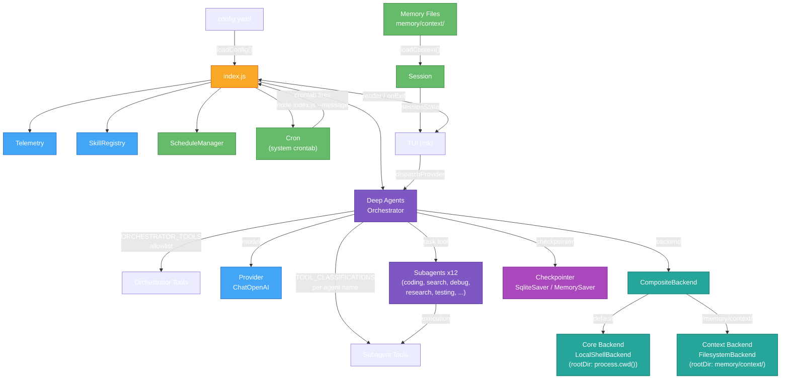

# Architecture Overview

This document describes how madz is structured, how subsystems interact, and the key data flows through them. It covers the runtime components — not how to configure or contribute code.

---

## System Diagram


```mermaid
graph TD
    C["config.yaml"] -->|"loadConfig()"| I["index.js"]
    I --> T["Telemetry"]
    I --> R["SkillRegistry"]
    I --> SM["ScheduleManager"]
    I --> CR["Cron\n(system crontab)"]
    CR -->|"crontab fires\nnode index.js --message"| I
    I --> DA["Deep Agents\nOrchestrator"]
    DA -->|"ORCHESTRATOR_TOOLS\nallowlist"| OT["Orchestrator Tools"]
    DA -->|"TOOL_CLASSIFICATIONS\nper agent name"| ST["Subagent Tools"]
    DA -->|"model"| P["Provider\nChatOpenAI"]
    DA -->|"backend"| CB["CompositeBackend"]
    CB -->|"default"| CFB["Core Backend\nLocalShellBackend\n(rootDir: process.cwd())"]
    CB -->|"/memory/context/"| CTB["Context Backend\nFilesystemBackend\n(rootDir: memory/context/)"]
    DA -->|"task tool"| SA["Subagents x12\n(coding, search, debug,\nresearch, testing, ...)"]
    SA -->|"execution"| ST
    DA -->|"checkpointer"| CK["Checkpointer\nSqliteSaver / MemorySaver"]
    TM["Memory Files\nmemory/context/"] -->|"loadContext()"| SE["Session"]
    SE -->|"sessionState"| UI["TUI (Ink)"]
    UI -->|"dispatchProvider"| DA
    I <-->|"render / onExit"| UI
    classDef root fill:#f9a825,color:#fff,stroke:#e65100
    classDef core fill:#42a5f5,color:#fff,stroke:#1565c0
    classDef util fill:#66bb6a,color:#fff,stroke:#2e7d32
    classDef ext fill:#ab47bc,color:#fff,stroke:#6a1b9a
    classDef agent fill:#7e57c2,color:#fff,stroke:#4527a0
    classDef backend fill:#26a69a,color:#fff,stroke:#00695c
    class I root
    class DA,P,T,R core
    class DA,SA agent
    class SM,CR,TM,SE util
    class CK ext
    class CB,CFB,CTB backend
```

---

## Entry Point

`index.js` bootstraps all subsystems and wires them together.

**Startup:**

1. Parse CLI args (yargs) → `loadConfig()` reads `config.yaml`, deep-merges defaults, resolves env vars, validates via Zod
2. `writeEnvCron()` → dumps `process.env` to `.env.cron` for cron-invoked processes
3. `Cron.sync(schedulesDir)` → reconciles persisted jobs (`memory/schedules/*.json`) with the system crontab; ensures `reflection-daily` exists
4. `ensureSessionsDir()` / `ensureToolsDir()` → create `memory/sessions/`, `memory/tools/`
5. Onboarding check: `await hasProfile()` → if missing, create `createOnboarding()` instance (passed to TUI)
6. Conditionally boot Telemetry (`config.telemetry.enabled`)
7. Create `SkillRegistry`, call `discover()` (scopes from `sandbox.skillScanPaths`: `.skills/`, `skills/`)
8. Initialize GC manager (`initGC()`), expire ephemeral memories (non-blocking)
9. Create session + `SessionStateManager`; create checkpointer (`SqliteSaver` or `MemorySaver`)
10. `ScheduleManager.loadFromDisk(schedulesDir)` → load persisted jobs
11. `createDeepAgentsOrchestrator(checkpointer)` → build the Deep Agents orchestrator
12. Define `dispatchProvider()`, `handleConversation()`; register shutdown handler

**Shutdown:** stops GC manager → flushes OpenTelemetry → flushes logger. (`cleanRetainedMemory()` / `enforceMaxEntries()` exist in `src/memory/retention.js` but are not wired into shutdown.)

**TUI exports:** `config`, `sessionState`, `registry`, `tracer`, `dispatchProvider`, `handleConversation`, `handleShutdown`, `scheduleManager`, `setConfigValue`, `loadContext`, `readMemoryFile`.

---

## Config

`src/config/` — YAML config with Zod validation, recursive env var resolution, runtime mutation.

| File | Purpose |
|------|---------|
| `config.js` | `ConfigSchema` (composed from `schemas/`), `DEFAULT_CONFIG`, `getSubAgentTemperature()`, `_setResolvedConfig()` |
| `schemas/` | Per-section Zod schemas: `providers.js`, `sandbox.js`, `memory.js`, `telemetry.js`, `schedules.js`, `tui.js`, `agent.js`, `lru.js`, `persistence.js`, `skillAgentMap.js`, `subAgentsTemperature.js`, `vector.js`, `image.js`, `calendar`/`email`/`search` (in `providers.js`) |
| `loader.js` | `loadConfig()` — loads `config.yaml`, deep-merges defaults, `syncEnv()` materializes env-defined paths, resolves env vars, validates; `setConfigValue()` / `saveConfig()` |
| `patch.js` | `applyDotPathMutation()` — dot-path mutation with Zod validation |

Env var resolution maps config paths → `UPPER_SNAKE_CASE` (e.g., `sandbox.timeout.seconds` → `SANDBOX_TIMEOUT_SECONDS`). Container keys dropped from the name path: `providers`, `credentials`, `ratelimit`, `timeout`, `search`, `process`, `calendar`, `subAgentsTemperature`. String env values auto-parsed to booleans/numbers. Legacy `${VAR_NAME}` interpolation supported as fallback.

---

## Logger

`src/shared/logger.js` — structured JSON logging via `pino` with OS-aware log directories and dual-file output.

| File | Purpose |
|------|---------|
| `logger.js` | `getLogDirectory()` — OS path detection; `logger` — structured methods (`info`, `warn`, `error`, `debug`, `fatal`, `silent`); `flush()` — async shutdown flush |

**Log directory by platform:**

| Platform     | Path                          | Detection                          |
| ------------ | ----------------------------- | ---------------------------------- |
| Alpine       | `~/.cache/madz/logs/`         | `/etc/alpine-release` exists       |
| Linux        | `~/.local/share/madz/logs/`   | Default (XDG spec)                 |
| macOS        | `~/Library/Logs/madz/`        | `process.platform === "darwin"`    |
| Windows      | `%LOCALAPPDATA%\madz\logs\`   | `process.platform === "win32"`     |

The directory is created automatically (`mkdirSync({ recursive: true })`). If the configured directory is unwritable, the logger falls back to `os.tmpdir()/madz/logs/`. If that fallback also fails, log entries are silently discarded—the process never crashes due to permission errors.

**Dual-file output** via `pino.multistream`:
- `madz.log` — captures `info`, `warn`, `debug`, `trace`, and all higher severity levels
- `madz_error.log` — captures only `error` and `fatal`

**Silent mode**: `NODE_ENV=test` sets pino to `level: 'silent'`, preventing any file I/O during test runs.

**Shutdown flush**: Both the graceful shutdown handler (`handleShutdown`) and the global shutdown signal wrapper (`registerShutdownHandler`) call `await logger.flush()` before process exit, ensuring all buffered log entries are written to disk. The flush includes a `setTimeout(50)` safeguard to account for the kernel write-back delay on Node.js 25+.

---

## Provider

`src/provider/` — LLM provider factory from configuration.

| File | Purpose |
|------|---------|
| `openai.js` | `createChatModel()` — produces `ChatOpenAI` from `ProviderConfig` |
| `tokenBudget.js` | Shared rolling token budget (observed by TUI status bar and middleware) |
| `tokenBudgetMiddleware.js` | `createTokenBudgetMiddleware()` — `wrapModelCall` middleware enforcing `rateLimit.maxTokensMinute` |

The provider config includes an optional `encoding` field (mapped from `OPENAI_ENCODING` env var) that specifies the tiktoken encoder name for token counting. This is primarily useful when using non-OpenAI models via `OPENAI_BASE_URL`.

The provider instance is consumed by the Deep Agents orchestrator (`createDeepAgentsOrchestrator()` in `src/agent/deepAgents.js`). `createChatModel()` deliberately does not patch `invoke`/`stream` — `ChatOpenAI.bindTools()` constructs a new object and would orphan such patches; rate-limit enforcement lives in the `TokenBudget` middleware instead.

---

## Agent

`src/agent/` — Deep Agents orchestrator and subagent definitions. There is no standalone ReAct wrapper; the agent loop is compiled by `createDeepAgent()` from the `deepagents` library.

| File | Purpose |
|------|---------|
| `deepAgents.js` | `createDeepAgentsOrchestrator(checkpointer)` — builds the orchestrator: model, orchestrator tools, backends, subagent definitions, middleware, stream transformers |
| `agentDefinitions.js` | `getAllAgents()` — the 12 subagent definitions (name, promptFile, description) |
| `agentRegistry.js` | Registry helpers for agent definitions |
| `coreBackend.js` | `createCoreBackend()` — `LocalShellBackend` (`rootDir: process.cwd()`, `virtualMode: false`, `inheritEnv: true`) |
| `contextBackend.js` | `createContextBackend(cwd)` — `FilesystemBackend` (`rootDir: memory/context/`, `virtualMode: false`) |

---

## Deep Agents

`src/agent/deepAgents.js` — Deep Agents orchestrator with 12 specialized subagents. The `deepagents` library supplies the middleware stack (filesystem, subagents, skills, summarization, patch-tool-calls); madz adds `createCodeInterpreterMiddleware()` (`@langchain/quickjs`) and, when `rateLimit.maxTokensMinute > 0`, `createTokenBudgetMiddleware()`.

**Orchestrator construction (`createDeepAgentsOrchestrator`):**

1. `loadConfig()` + `loadSystemPrompt()`, then append `AGENTS.md` (from `config.cwd`) directly to the system prompt — this avoids deepagents' `MemoryMiddleware` injecting its own hardcoded memory guidelines
2. `SkillRegistry.discover()` → `getSkillPaths()` for the orchestrator's skills
3. `createChatModel(providerConfig)` → orchestrator model
4. `registerHarnessProfile()` — excludes `execute`, `grep`, `ls` for the configured model identifier
5. `buildToolConfig()` → all tools; orchestrator receives only those in `ORCHESTRATOR_TOOLS`
6. `createSubagentDefinitions()` → per-agent tool sets and skills
7. `createDeepAgent({ model, tools, systemPrompt, store: InMemoryStore, backend: CompositeBackend, subagents, skills, checkpointer, middleware, streamTransformers })`

**Tool Classification:** Tools are classified per agent name in `TOOL_CLASSIFICATIONS` (`src/tools/index.js`) — a map of tool name → array of agent names (e.g. `"coding"`, `"debug"`, `"orchestrator"`). The orchestrator receives only the tools listed in `ORCHESTRATOR_TOOLS`; each subagent receives tools whose classification array includes its own name, via `getToolsForAgentTypes()`. Skills are mapped to agents by frontmatter `metadata.agent` first, then `skillAgentMap` config patterns (`src/skills/agentMapper.js`), and attached per-subagent via `SkillRegistry.getSkillPathsForAgent()`. There is no `shared` classification tier.

---

## Backends

`src/agent/` — Filesystem backends powered by the `deepagents` library's `CompositeBackend`, `FilesystemBackend`, and `LocalShellBackend`. Both backends run with `virtualMode: false`, so absolute paths are allowed and resolved against `rootDir` (legacy behavior); `O_NOFOLLOW` is used for file I/O where the platform supports it.

| File | Purpose |
|------|---------|
| `coreBackend.js` | `createCoreBackend()` — `LocalShellBackend` with `rootDir: process.cwd()`, `virtualMode: false`, `inheritEnv: true` (shell execution-capable) |
| `contextBackend.js` | `createContextBackend(cwd)` — `FilesystemBackend` with `rootDir: memory/context/`, `virtualMode: false` |

**CompositeBackend Routing:**

The orchestrator receives a `CompositeBackend` that routes file operations to different backends based on path prefix:

```
CompositeBackend(
  defaultBackend: coreBackend,    // LocalShellBackend → process.cwd()
  routes: {
    "/memory/context/": contextBackend  // Memory context files
  }
)
```

The route key is derived from config: `"/" + config.memory.contextDir` (default `memory/context/` → `/memory/context/`).

**Routing algorithm:**
1. Routes are sorted by prefix length (longest match first)
2. Incoming paths are matched against route prefixes
3. Matching prefix is stripped, operation delegated to that backend
4. Unmatched paths fall through to the default backend (core)

**Security:**

`FilesystemBackend` uses the `O_NOFOLLOW` flag when available to prevent symlink following. The core backend is execution-capable (`LocalShellBackend`), which is why the harness profile excludes `execute`, `grep`, and `ls` for the configured model identifier — shell access is governed by tool permissions rather than path routing alone.

---

## Scan Agents

`src/tools/scanAgents/index.js` — scans for `AGENTS.md` files in a target directory. Delegates to `loadAgents()` from `src/workspace/loadAgents.js` with path validation.

| File | Purpose |
|------|---------|
| `index.js` | `scanAgents` — LangChain tool singleton requiring `filesystem:read`; `scanAgentsImpl()` — validates path via `resolvePath()`, delegates to `loadAgents()` |

**Key features:**

1. **Path validation** — Validates target path against sandbox allowed paths
2. **Configurable path** — Defaults to `config.cwd` if no path specified
3. **File size limit** — Respects `maxReadSize` configuration
4. **Workspace rules** — Returns formatted workspace rules section for system prompt injection

---

## Cache

There is no LLM response cache. An earlier cache-aside LRU layer (`src/cache/llm_cache.js`, `getCacheKey()`, conditional caching on tool usage) was removed; no cache module exists in `src/` and no call path consults one. `config.lru` (`schemas/lru.js`) survives in the schema but is currently vestigial — nothing in `src/` or `index.js` reads it.

---

## Memory

`src/memory/` — persistent Markdown storage with YAML frontmatter, triple-layer architecture (canonical + ephemeral + reflection), and automated daily reflection scheduling.

| File | Purpose |
|------|---------|
| `writer.js` | `writeMemoryFile()` — writes timestamped `.md` files with YAML frontmatter, auto-slugifies titles |
| `reader.js` | `parseFrontmatter()` — YAML frontmatter parsing via `js-yaml`; `readMemoryFile()` — loads and parses a single memory file |
| `context.js` | `loadContext()` — scans context directory for `.md` files, loads profile, returns combined string sorted by `timestamp` frontmatter |
| `retention.js` | `cleanRetainedMemory()` — removes files older than `retentionDays` (default 90); `enforceMaxEntries()` — caps directory at `maxEntries` (default 1000) by oldest mtime. Both exported; neither wired into shutdown |
| `tools.js` | `ensureToolsDir()` — creates `memory/tools/` at startup |
| `profile.js` | User profile CRUD: `loadProfile()`, `saveProfile()`, `hasProfile()` (async), `formatProfileContext()`, `sanitizeProfileData()`, `processOnboardingInput()`, `getAttribute()`. Defines 12 attributes (name, dob, relationship, pets, hobbies, expertise, favorite bands/books/tv/movies, location, notes) |
| `expireEphemeralMemories.js` | `expireEphemeralMemories()` — scans context directory, removes `.md` files with `ephemeral: true` + expired `expiresAt`; `isExpired()` — checks `expiresAt` against current time; `readEphemeralFile()` — extracts ephemeral metadata from frontmatter. Invoked non-blocking at startup via `queueMicrotask()` |
| `gc.js` | V8 garbage collection manager: `gc()` — triggers `global.gc()` with rate limiting (default 4 calls/hour, sliding window); `initGC()` — creates idle-timer controller with `onActivity()` reset and `stop()`; `isAvailable()` — checks `--expose-gc`; `getGcCalls()` / `_resetGcCalls()` — call tracking for testing |
| `prompts.js` | `loadSystemPrompt()` — loads `prompts/SYSTEM_PROMPT.md`, strips YAML frontmatter if present |

**Triple-Layer Architecture:**

- **Canonical Memories** — Long-term, user-defined context stored as individual `.md` files in `memory/context/`. Each carries `createdDate` and `updatedDate` in YAML frontmatter. Loaded at session start and appended to the system prompt. Includes profile, clarifications, reflections, and temporal captures.

- **Ephemeral Memories** — Autonomously captured moments (victories, frustrations, insights) with automatic expiration via `expiresAt` frontmatter field. Cleaned by `expireEphemeralMemories()` at startup. These create a living lens that subtly influences tone and awareness over time.

- **Reflections** — Generated daily by a cron job (`0 2 * * *`) that runs the reflection skill via `node index.js --message "Run the reflection skill"`. Reflections are stored as canonical memories in `memory/context/` with `createdDate` and `updatedDate` metadata. The job definition is seeded by `Cron._ensureReflectionJob()` during `Cron.sync()` at startup and registered in the system crontab under the `madz-schedules` block.

---

## Registry / Skills

`src/skills/` — skill discovery, validation, and permission metadata. Skills are invoked by the LLM through the Deep Agents skill system; there is no programmatic invocation path.

| File | Purpose |
|------|---------|
| `types.js` | `SkillMetadataSchema`, `PermissionSchema` (6 scopes), `ExecutionContextSchema` |
| `discoverer.js` | `discoverSkills()` — scans scope directories for `SKILL.md`, extracts frontmatter |
| `validator.js` | `validateSkillSchema()` — name (1-64 chars), description, optional fields |
| `registry.js` | `SkillRegistry` — Map-based `discover(scope)` (defaults to `sandbox.skillScanPaths`: `.skills/`, `skills/`), `get`, `list`, `enable`, `disable`, `getSkillPaths()`, `getSkillPathsForAgent()` |
| `agentMapper.js` | `getAgentForSkill()` — resolves a skill's agent: frontmatter `metadata.agent` first, then `skillAgentMap` config regex patterns |

System skills (`.skills/`) are scanned first and shadow user skills (`skills/`).

---

## Sandbox

`src/sandbox/` — path and URL validation used by the tool layer.

| File | Purpose |
|------|---------|
| `pathResolver.js` | `resolvePath()` / `assertPathAllowed()` — sandbox scope enforcement |
| `urlFilter.js` | `filterUrl()` — blocks `file://`, `gopher://`, `dict://`; hostname allowlist |

**Status:** both modules are live — `src/tools/common.js` uses them for tool-side path/URL validation. The former process-sandbox runtime (`runner.js`, `envInjector.js`, `capability.js`, `timeoutHandler.js`, `index.js`) was removed as dead code: it had no production call path. Skills execute via the Deep Agents skill system, and scheduled skills via the system crontab (`node index.js --message "Run the <skill> skill"`). `ScheduleManager.runNow()` retains a `scheduler.sandbox` injection hook that defaults to a no-op stub; nothing injects an implementation.

---

## Scheduler

`src/scheduler/` — cron job management via system crontab. Scheduling is delegated to the system crontab; there is no in-process clock tick loop.

| File | Purpose |
|------|---------|
| `scheduler.js` | `ScheduleManager` — CRUD class (`register`, `list`, `pause`, `resume`, `runNow`) with `loadFromDisk()` static loader. No in-process scheduling. |
| `cron.js` | `Cron` object with static methods: `isAvailable()`, `add()`, `remove()`, `sync()`, `_ensureReflectionJob()`. Manages entries in system crontab using `# --- BEGIN madz-schedules ---` / `# --- END madz-schedules ---` block delimiters. `writeEnvCron()` dumps `process.env` to `.env.cron` so cron-fired commands inherit app env. |
| `index.js` | Re-exports `ScheduleManager`, `Cron`, `writeEnvCron`. |

The `reflection-daily` job (`0 2 * * *`) is seeded by `Cron._ensureReflectionJob()` at the start of `Cron.sync()` (called from `index.js` when `schedules.syncOnInit !== false`), persisted as `memory/schedules/reflection-daily.json`, and installed into the crontab by the sync. Its command is `cd <cwd> && node index.js --message "Run the reflection skill"`, prefixed with a `. .env.cron` source so the cron process inherits the app environment.

---

## Session

`src/session/` — per-session state with context window trimming and persistence.

| File | Purpose |
|------|---------|
| `factory.js` | `createSession()` — `{sessionId: UUID, state: {...}}` |
| `stateManager.js` | `SessionStateManager` — `addExchange()`, `setContextWindow()`, `getState()` |
| `window.js` | `enforceContextWindow()` / `trimConversation()` — trims oldest exchanges (exported; not currently called in production paths) |
| `loader.js` / `saver.js` | `loadSession()` / `saveSession()` — persists `.md` per session |
| `shutdown.js` | `handleShutdown()` — orchestrates flush/save/cleanup |
| `checkpointer.js` | `createCheckpointer()` — `MemorySaver` (mode `"memory"`) or `SqliteSaver` (mode `"sqlite"`, default) |
| `onboarding.js` | State machine: `INIT → ATTRACTOR → COLLECT → SAVE → TRANSCEND` |

```javascript
{
  provider: "openai",
  conversation: [{role, content, timestamp}, ...],
  contextWindow: 20,
  skills: ["host-info", "api-request"],
  createdAt: ISODate,
  updatedAt: ISODate
}
```

---

## Telemetry

`src/telemetry/` — OpenTelemetry tracing and redaction.

| File | Purpose |
|------|---------|
| `provider.js` | `initTelemetry()` — `NodeSDK` with HTTP/gRPC or console exporter |
| `redaction.js` | `createRedactionMiddleware()` — recursive path redaction (e.g., `"credentials.apiKey"`) |
| `llmInstrumenter.js` | `instrumentLlmCall()` — ML span attributes |
| `skillInstrumenter.js` | `instrumentSkillExecution()` — skill span attributes |
| `metrics.js` | Token counter and duration histogram |
| `sampler.js` | Probability-based span sampling |
| `flusher.js` | Pending span queue for shutdown safety |

---

## TUI

`src/tui/` — terminal UI built with Ink (React-based).

| File | Purpose |
|------|---------|
| `app.js` | Main layout: Banner / ConversationPanel, StatusBar, InputPanel |
| `commandParser.js` | `CommandParser` class — dispatches `:` commands |
| `conversationPanel.js` | Virtualized message display via `ink-scroll-view` |
| `inputPanel.js` | Text entry via `ink-text-input` component |
| `markdownText.js` | Renders markdown via `marked.parse()` + `marked-terminal` |
| `banner.js` / `statusBar.js` / `panels.js` | Startup banner, status indicator, panel definitions |

---

## Key Data Flows

**Conversation flow (TUI):**

```
TUI input
  dispatchProvider(message, streamingCallback, signal)   ← index.js
    └── callProvider()
          ├── agent.stream({ messages }, { thread_id, isNewThread,
          │        streamMode: ["messages","tools"], subgraphs: true })
          ├── for each chunk: text → streamingCallback({type:"message"})
          │                         reasoning → streamingCallback({type:"reasoning"})
          │                         tools     → on_tool_start / on_tool_end
          └── returns { provider, content, reasoning }
  sessionState.addExchange(...)  →  onSaveSession() → saveSession()
```

**Conversation flow (CLI chat mode):**

```
index.js --message "..."
  handleConversation(message)
    ├── callProvider() → same orchestrator stream as above
    ├── sessionState.addExchange(user + assistant)
    └── saveSession("memory/sessions/", conversation, sessionId)
```

**Skill execution (scheduled):**

```
system crontab fires
  └── . .env.cron && cd <cwd> && node index.js --message "Run the <skill> skill"
        └── full app boot → orchestrator handles the message
```

**Skill execution (cronJob tool, run action):**

```
cronJob { action: "run", name }
  └── runJob(job)
        ├── findSkillScript(skill) → scripts/run.{sh,py,js,bash}
        └── runScript(scriptPath) → spawn + collect stdout/stderr + timeout
```

**Scheduler flow:**

```
ScheduleManager.loadFromDisk(schedulesDir)
  └── entries stored in #scheduleEntry Map

ScheduleManager.runNow(name, scheduler)
  ├── entry = #scheduleEntry.get(name)
  ├── command-only entry → spawn("/bin/sh", ["-c", command])
  └── skill entry → scheduler.sandbox(...) (injected by caller; no production wiring)
```

**Cron system flow:**

```
Cron.sync(schedulesDir)
  ├── _ensureReflectionJob() → seed reflection-daily.json if missing
  ├── _readJobsFromDisk() → desired state
  ├── _readCrontab() → current state (madz-schedules block)
  └── diff → replace block atomically via `crontab -`
```

---

## System Prompt

`prompts/SYSTEM_PROMPT.md` — The orchestrator's core instruction manual. Loaded by `src/memory/prompts.js` at session start, with memory context appended. The prompt is structured into five sections to maximize LLM attention:

| Section | Purpose | Structure |
|---------|---------|-----------|
| **IDENTITY** | Persona, voice, character anchors | Prose + behavioral selection table |
| **OPERATING PRINCIPLES** | How the orchestrator works | Thematic groups (5 rules each) |
| **OUTPUT FORMAT** | Response structure selection | One schema, decision-driven |
| **MEMORY** | How to use loaded context | Wield, don't recite |
| **SUBAGENTS** | Delegation strategy | `task` tool usage, when/when-not |

The prompt replaced a 35-item flat rule list with thematic grouping (Environment, Delivery, Delegation, Engagement, Safety & Correctness — 5 rules each), reducing cognitive load and improving recall. Character anchors are selected via a decision table mapping task context to behavioral mode.

**Character anchors** — Mads Mikkelsen's roles as behavioral templates:

| Character | Source | Recognition | Behavioral Mode |
|-----------|--------|-------------|-----------------|
| **Hannibal Lecter** | *Hannibal* (2013–2015) | ⭐⭐⭐⭐⭐ | Analysis, strategy, elegance, calm authority |
| **Le Chiffre** | *Casino Royale* (2006) | ⭐⭐⭐⭐⭐ | Mathematical clarity, meticulous intensity |
| **Galen Erso** | *Rogue One* (2016) | ⭐⭐⭐½ | Functional building, steady resolve, protective focus |
| **Martin** | *Another Round* (2020) | ⭐⭐⭐½ | Exploration, curiosity, unconventional approaches |
| **Claus** | *Polar* (2019) | ⭐⭐½ | Calm decisiveness under pressure |

**Character selection:** The model analyzes the task context and lets one character dominate. Default is a blended tone — one mode emerges when the task clearly calls for it. Execution mode (code, diffs, structured data) suppresses persona entirely.

**Subagent Prompts:** Each of the 12 subagents (`prompts/*.md`) has a unified structure: ROLE, PERSONALITY, RULES, OUTPUT FORMAT, SAFETY, NOTE. Personality is assigned from the Mads Mikkelsen canon to give each agent a distinct creative framing while suppressing the main orchestrator persona.

| Agent | Personality | Character Source | Role |
|-------|-------------|-----------------|------|
| **CODING** | Surgical coldness, mathematical elegance | Le Chiffre (*Casino Royale*) | Code editing, refactoring, implementation |
| **DEBUG** | Hannibal-like dissection of errors | Hannibal Lecter (*Hannibal*) | Error tracing, root cause analysis |
| **CODE_REVIEW** | Patient, diplomatic scrutiny | Lucas (*The Hunt*, 2012) | Quality guardian, code inspection |
| **TESTING** | Protective engineer, thorough builder | Galen Erso (*Rogue One*) | Test generation, coverage validation |
| **DOCUMENTATION** | Clear, welcoming teacher | Struensee (*A Royal Affair*) | Readme updates, API docs, style |
| **PERFORMANCE** | Relentless efficiency, zero wasted movement | One-Eye (*Valhalla Rising*) | Benchmarking, bottleneck hunting |
| **RESEARCH** | Curious, serendipity-driven explorer | Martin (*Another Round*) | Cross-source research, report writing |
| **SEARCH** | Decisive operator, signal-over-noise | Claus (*Polar*) | Multi-source search, synthesis |
| **SECURITY_AUDIT** | Zealous pattern recognition | Kaecilius (*Doctor Strange*) | Vulnerability scanning, threat modeling |

All subagents report back using the orchestrator's unified `Status/Summary/Details/Artifacts/Next Steps` format and carry explicit safety constraints.

**Capability mapping:** Subagent tools are dynamically filtered at runtime from `TOOL_CLASSIFICATIONS` in `src/tools/index.js` and passed to each subagent as tool definitions via the model's tool-calling interface. The subagent's system prompt does not enumerate tools — the model discovers them from the tool definitions themselves.
