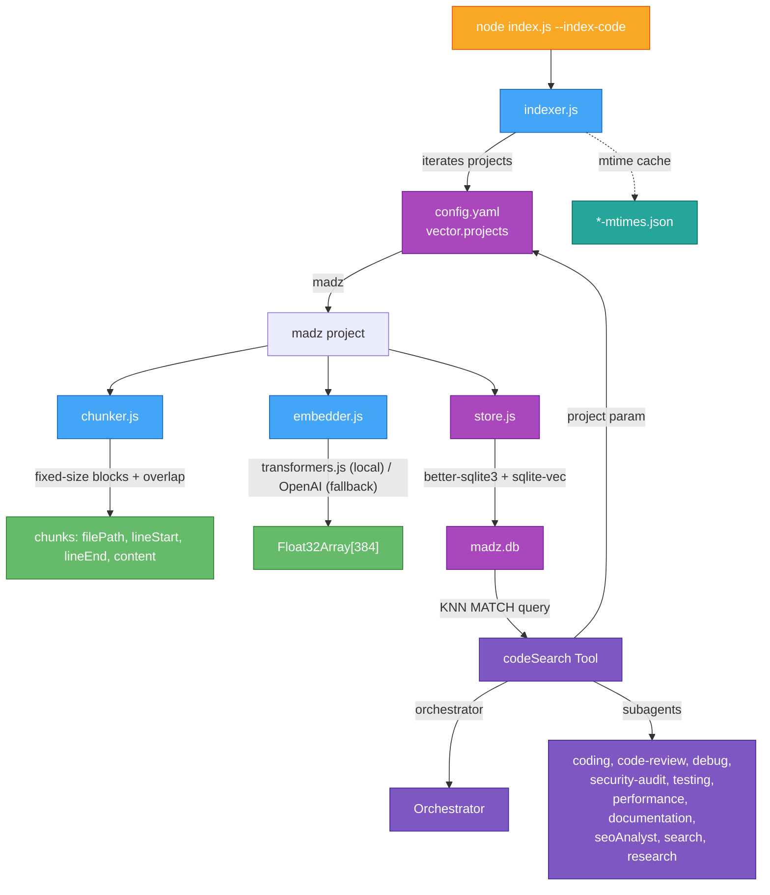

# Vector Search

Semantic code search using local vector embeddings and SQLite-based KNN retrieval. Enables finding code by meaning rather than exact keyword matches — useful for debugging, refactoring, and feature implementation across any project.

## Architecture



## Modules

### `src/vector/chunker.js`

Splits source files into fixed-size line blocks with configurable overlap. Avoids AST complexity — no parser dependency.

- **Default chunk size:** 96 lines
- **Default overlap:** 16 lines
- Skips binary files via extension allowlist and null-byte detection
- Returns chunks with `filePath`, `lineStart`, `lineEnd`, `content`

### `src/vector/embedder.js`

Generates 384-dimensional embeddings for code chunks. Two backends:

| Mode | Provider | Model | Requirements |
|------|----------|-------|-------------|
| `local` (default) | transformers.js | `Xenova/all-MiniLM-L6-v2` | Model downloaded on first use (~23 MB), cached locally |
| `openai` | OpenAI API | `text-embedding-3-small` | `OPENAI_API_KEY` env var |

The local pipeline loads lazily on first embed call and falls back gracefully if unavailable.

### `src/vector/store.js`

SQLite-backed vector store using `better-sqlite3` + `@photostructure/sqlite-vec`.

**Schema:**

```sql
-- Chunk metadata and content
CREATE TABLE code_chunks (
  id INTEGER PRIMARY KEY,
  file_path TEXT NOT NULL,
  line_start INTEGER NOT NULL,
  line_end INTEGER NOT NULL,
  content TEXT NOT NULL
);

-- vec0 virtual table for vector search (cosine distance)
CREATE VIRTUAL TABLE vec_code_chunks USING vec0(
  id integer primary key,
  embedding float[384] distance_metric=cosine
);
```

**Query pattern (KNN):**

```sql
SELECT c.id, c.file_path, c.line_start, c.line_end, c.content, v.distance
FROM vec_code_chunks v
JOIN code_chunks c ON c.id = v.id
WHERE v.embedding MATCH ?
  AND v.k = ?
ORDER BY v.distance;
```

Uses WAL journal mode for concurrent read performance. Supports incremental upsert — removing and re-inserting chunks for a file path in a single transaction.

### `src/vector/indexer.js`

Orchestrates the full indexing pipeline:

1. **Scan** — Recursively walks the project directory, matching include/exclude glob patterns
2. **Filter** — Skips binary files, hidden files, files exceeding `maxFileSize` (default 500 KB)
3. **Mtime check** — Compares file modification times against a persisted cache (`vector-mtimes.json`) to skip unchanged files
4. **Chunk** — Splits each file into overlapping line blocks
5. **Embed** — Generates embeddings for all chunks in a file (batched)
6. **Store** — Removes old chunks for the file, inserts new ones in a transaction
7. **Cache** — Updates the mtime cache

**Incremental indexing:** Only processes files whose mtime has changed since the last index. Pass `--force` to re-index everything.

### `src/tools/codeSearch/index.js`

LangChain tool available to the orchestrator and all code-related subagents.

**Input schema:**

| Field | Type | Default | Description |
|-------|------|---------|-------------|
| `query` | string | required | Natural language query describing the code to find |
| `topK` | number | 5 | Number of results (1–50) |
| `project` | string | first configured | Project name from `vector.projects` in config.yaml |
| `fileFilter` | string | optional | Glob pattern to filter results (e.g., `src/tools/*.js`) |

**Output:** Formatted list of matching code chunks with file paths, line ranges, content, and cosine distance scores.

## Configuration

### `config.yaml`

```yaml
vector:
  model: local                    # "local" or "openai" — shared across all projects
  projects:
    madz:
      rootDir: .                  # Root directory to scan
      dbPath: memory/vectorSearch/madz.db
      chunkSize: 96               # Lines per chunk
      chunkOverlap: 16            # Overlap between consecutive chunks
      maxFileSize: 524288         # Max file size in bytes (500 KB)
      include:
        - "src/**/*.js"
        - "src/**/*.mjs"
        - "src/**/*.cjs"
      exclude:
        - "node_modules/**"
        - ".git/**"
        - ".worktrees/**"
```

Each named project under `vector.projects` defines its own root directory, database path, and indexing rules. This allows multiple projects to be indexed independently — e.g., mounting external project directories into the container and adding a corresponding project entry.

### Environment Variables

| Variable | Purpose |
|----------|---------|
| `OPENAI_API_KEY` | Required when `model: openai` |

## Usage

### Indexing

```bash
# Index all configured projects (downloads model on first run)
node index.js --index-code

# Force re-index all files across all projects
node index.js --index-code --force
```

Indexing iterates over every project in `vector.projects`, creating or updating each project's database independently.

### Querying

Via the `codeSearch` tool, available to any agent:

```
codeSearch(query="how does SSE streaming work", topK=3)
codeSearch(query="tool registration pattern", project="madz")
codeSearch(query="authentication flow", project="madz", fileFilter="src/tools/*.js")
```

The `project` parameter selects which indexed project to search. Defaults to the first configured project if omitted.

### Verification

```bash
# Check DB exists and count indexed chunks for a project
node -e "
const Database = require('better-sqlite3');
const db = new Database('memory/vectorSearch/madz.db');
console.log('Chunks:', db.prepare('SELECT COUNT(*) as c FROM code_chunks').get().c);
db.close();
"

# Test a semantic query against a specific project
node -e "
const { createVectorStore } = await import('./src/vector/store.js');
const { createEmbedder } = await import('./src/vector/embedder.js');
const store = await createVectorStore('memory/vectorSearch/madz.db');
store.init();
const embedder = createEmbedder({ model: 'local' });
const [vec] = await embedder.embed(['your query here']);
const results = store.search(vec, 5);
store.close();
console.log(JSON.stringify(results.map(r => r.filePath + ':' + r.lineStart + '-' + r.lineEnd + ' (' + r.distance.toFixed(4) + ')'), null, 2));
"
```

## Phased Goals

### Phase 1 ✅ — madz Self-Indexing (Complete)

- Index the madz project's own `src/` directory
- `codeSearch` tool available to orchestrator and all subagents
- Local embedding via transformers.js (no external dependencies)
- Incremental indexing via mtime cache
- CLI flag `--index-code` for one-shot indexing
- Config-driven include/exclude patterns

### Phase 2 ✅ — Multi-Project Config (Complete)

- Named project entries under `vector.projects` in config.yaml
- Each project defines its own `rootDir`, `dbPath`, include/exclude patterns, and chunking params
- `codeSearch` tool accepts an optional `project` parameter (defaults to first configured)
- Indexer iterates all projects on `--index-code`
- Foundation laid for mounting external project directories into the container

### Language Support

Language support is handled entirely through include patterns in each project's config. Whatever languages are present in the project — whether installed at Docker build time or mounted at runtime — just add their extensions to the project's `include` list. No per-language logic, no language-specific chunking, no per-project embedding models. The chunker treats all text as lines; the embedder works on any natural language or code text.

## Dependencies

| Package | Version | Purpose |
|---------|---------|---------|
| `@photostructure/sqlite-vec` | ^1.1.1 | SQLite vector search extension (production-ready fork) |
| `@xenova/transformers` | ^2.17.2 | In-process transformer inference via ONNX Runtime |
| `better-sqlite3` | (existing) | Synchronous SQLite3 bindings |

## Storage Layout

```
memory/
├── vectorSearch/
│   ├── madz.db                  # SQLite database for the "madz" project
│   ├── madz-mtimes.json         # File mtime cache for incremental indexing
│   └── ...                      # Additional project databases as configured
└── checkpoints/                 # LangGraph checkpoint storage (separate concern)
    └── checkpoints.db
```
